# Entity relationship diagram

**Last updated:** 2026-08-23 · covers tasks 1.1 – 1.4
Source of truth is `packages/db/prisma/schema.prisma`; this file is the map, not the law.

Mermaid rather than an image, so it diffs and reviews like code (`CLAUDE.md` §7.4).

## The whole schema

```mermaid
erDiagram
    User ||--o{ Session : "signs in on"
    User ||--o{ VerificationToken : "is emailed"
    User ||--o{ NotificationPreference : "chooses"
    User ||--o{ Course : "authors"
    Session ||--o{ RefreshToken : "rotates through"
    Category ||--o{ Category : "parent of"
    Category ||--o{ Course : "classifies"
    Course ||--o{ Section : "contains"
    Course ||--o{ CourseEdit : "undo stack"
    Section ||--o{ Lecture : "contains"

    User {
        string id PK
        string email UK
        string passwordHash "null for OAuth-only"
        enum role "LEARNER INSTRUCTOR ADMIN"
        datetime emailVerified
    }
    Session {
        string id PK
        string userId FK
        string userAgent "never used for authz"
        datetime revokedAt
        enum revokedReason
    }
    RefreshToken {
        string id PK
        string sessionId FK
        string tokenHash UK "SHA-256, never the token"
        datetime usedAt "non-null + presented = reuse"
    }
    VerificationToken {
        string id PK
        string userId FK
        enum purpose "EMAIL_VERIFICATION PASSWORD_RESET"
        string tokenHash UK
        datetime usedAt
    }
    OutboxMessage {
        string id PK
        string eventId UK "stable across retries"
        string type
        json payload
        enum status "PENDING PUBLISHING PUBLISHED DEAD"
        datetime availableAt "doubles as visibility deadline"
    }
    ProcessedEvent {
        string eventId PK
        string handler PK
    }
    IdempotencyRecord {
        string scope PK
        string key PK
        string requestHash
        json response
    }
    EmailDelivery {
        string id PK
        string eventId "with template+recipient, UK"
        string template
        string recipient
        enum status "SENDING SENT FAILED SUPPRESSED BOUNCED COMPLAINED"
        string providerMessageId
    }
    EmailSuppression {
        string email PK
        enum reason "HARD_BOUNCE COMPLAINT MANUAL"
    }
    NotificationPreference {
        string userId PK
        enum category PK
        boolean enabled "absent row = subscribed"
    }
    Category {
        string id PK
        string slug UK
        string parentId FK "two levels only"
    }
    Course {
        string id PK
        string slug UK "never regenerated on rename"
        enum status "DRAFT IN_REVIEW PUBLISHED ARCHIVED"
        datetime publishedAt "stamped once"
        int priceMinor "minor units, never a float"
        enum currency
        string instructorId FK
        string categoryId FK
        decimal ratingAverage "denormalised, written by engagement"
        datetime priceSetAt "free vs not-yet-priced"
        int version "optimistic concurrency, claimed conditionally"
    }
    CourseEdit {
        string id PK
        string courseId FK
        string kind "the Command's discriminator"
        json command "as received"
        json inverse "computed before it was applied"
        int version "the version this edit produced — the stack order"
        datetime undoneAt "null while undoable"
    }
    Section {
        string id PK
        string courseId FK
        int position "unique per course, gaps of 10"
    }
    Lecture {
        string id PK
        string sectionId FK
        int position "unique per section"
        boolean isPreview "read by the entitlement engine"
        string assetId "media's id — shared, not copied"
    }
```

`OutboxMessage`, `ProcessedEvent`, `IdempotencyRecord`, `EmailDelivery` and
`EmailSuppression` have no foreign keys into the domain on purpose, so they are drawn
unconnected. They are mechanism, not domain: an outbox row must survive the deletion of
whatever produced it, and a suppression is a fact about an address rather than about a user.

## Invariants worth knowing, by context

### identity

- `passwordHash` is null **iff** the account is OAuth-only, and such an account can never
  pass password login.
- A `RefreshToken` row is **never deleted**. You cannot detect the replay of a row you
  removed, and that detection is the whole point of the module.
- At most one _unused_ refresh token per session at a time; at most one unused
  `VerificationToken` per `(user, purpose)`.

### platform kernel

- An `OutboxMessage` exists **if and only if** the state change that caused it committed —
  they are written in the same transaction.
- `ProcessedEvent(eventId, handler)` is written **after** the handler succeeds. Its presence
  means "this effect has happened".

### notification

- `(eventId, template, recipient)` is unique, and that uniqueness _is_ the idempotency
  guarantee. One row is one email.
- `EmailSuppression` outranks `NotificationPreference` and every mandatory category: a
  bounce is a fact about a mailbox, not a preference.
- An absent `NotificationPreference` row means **subscribed**, so a new account needs no
  rows written at signup and a new category defaults to on.

### catalog

- `Course` is an aggregate root. `Section` and `Lecture` have no independent lifecycle and
  cascade with it — which is why there is no `SectionRepository`.
- `(courseId, position)` and `(sectionId, position)` are unique **in the database**. A table
  that permits two sections at position 3 will eventually contain two sections at position 3.
- `publishedAt` is stamped on the first publish and never moved. It is the catalog's sort
  key, and a republished course jumping to the top of "newest" is a bug.
- `instructorId` is a real foreign key with `onDelete: Restrict`, across a context boundary.
  ADR-0001 accepted one database; referential integrity beats notional decoupling.
- `ratingAverage` / `ratingSum` / `ratingCount` and `enrollmentCount` are **denormalised and
  read-only here** — written by `engagement` (1.14) and `enrollment` (1.10) inside their own
  transactions. The force is the list query: an AVG over a reviews table on every catalog
  page is a join and a sort no index can rescue. Task 1.14 owes the reconciliation job.
- `Lecture.assetId` is a plain string, not a relation: media owns that lifecycle, and a
  duplicated course deliberately **shares** the value rather than copying gigabytes.
- `Course.version` is bumped by **every content write** and claimed conditionally
  (`WHERE id = ? AND version = ?`), as the first statement of the transaction — so the same
  statement both validates optimistic concurrency and takes the row lock. See
  [`lld/wizard-draft-state.md`](../lld/wizard-draft-state.md).
- `Course.priceSetAt` exists because `priceMinor = 0` is ambiguous: it is both "this course
  is free" and "nobody has priced it yet", and the publish gate has to tell them apart.
- `CourseEdit` stores each curriculum command **and its inverse**, because the inverse of a
  removal is the content that was removed and that only exists before the delete runs. It is
  a table rather than an in-memory stack because the API is more than one task, and the tab
  that made an edit is not guaranteed to reach the same process when it presses undo.

### media

- **`Asset` and `UploadSession` are separate tables because they have different lifetimes.**
  The asset is referenced by a lecture for years; the session is a transfer protocol that
  stops mattering in hours. One table would leave a lecture joining to `partSize`.
- **There is deliberately no `upload_parts` table.** Parts are PUT by the browser straight
  to object storage, so the API never observes one landing — a row per part would be a
  second copy of a fact only the provider knows, written by a client allowed to crash, and
  it would disagree with reality exactly during the resume it existed to serve. `ListParts`
  is the authority. See [ADR-0017](../adr/0017-provider-truth-for-upload-progress.md).
- `Asset.sizeBytes` is a **`BigInt`**. A 4 GB recording overflows INT4's 2 147 483 647, and
  the failure would be a silently truncated size. It crosses the wire as a decimal string,
  because `JSON.stringify` throws on a BigInt.
- `Asset.storageKey` is **unique and derived from the asset id**, never from the filename —
  which is attacker-controlled and may contain `../`. It is fixed before the first byte
  moves, which is what makes completing an upload twice address the same object, and what
  lets task 1.7 derive idempotent transcode output keys from it.
- `Asset.status = PENDING` is the honest default: the row is created when the upload
  _starts_, so an id can be handed back immediately. `FAILED` is set by the reaper — a
  PENDING asset whose session expired is not "still waiting".
- `UploadSession.status` includes **`COMPLETING`** because `CompleteMultipartUpload` is not
  idempotent: it is the claim that makes exactly one caller reach the provider. Sessions are
  moved with conditional updates (`WHERE id = ? AND status = ?`), so a reaper's expire and a
  browser's complete cannot both land.
- `UploadSession.partSize` / `partCount` store the plan the client was given, so a resume
  re-signs _the same_ boundaries. Re-deriving them from a size the client re-sends would let
  a second call silently repartition a half-finished upload.

## Indexes

Every non-primary-key index, the query it serves, and its measured `EXPLAIN ANALYZE`
before/after are in [`indexes.md`](indexes.md).
