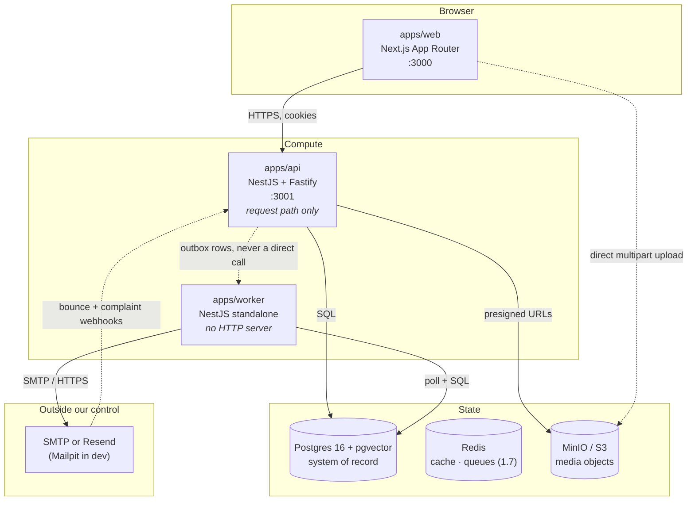

# Architecture — containers and their responsibilities

**Status:** incremental — describes what exists, not what is planned
**Last updated:** 2026-08-22 · covers tasks 1.1 – 1.3

> Written the week the first cross-context flow appeared (`CLAUDE.md` §7.4), not in Phase 5.
> Everything below is running in `docker compose`; nothing here is aspirational. Containers
> that arrive later (Typesense, the Whisper worker, CloudFront) are named in
> [`05-scaling.md`](05-scaling.md) and deliberately absent here.

## 1. C4 level 2 — containers

The dotted edges are the load-bearing ones. **`api` never calls `worker`.** It writes a row;
the worker finds it. That is the only thing keeping a slow or dead mail provider from
appearing as latency on a signup.

## 2. What each container is responsible for

| Container  | Owns                                                                                                                        | Explicitly does **not**                                                                               | Scales on           |
| ---------- | --------------------------------------------------------------------------------------------------------------------------- | ----------------------------------------------------------------------------------------------------- | ------------------- |
| `api`      | The request path: authentication, authorization, validation, writing state + outbox rows in one transaction, presigned URLs | Send email, transcode, poll anything, run a loop                                                      | Request rate        |
| `worker`   | Everything that happens _after_ a request: the outbox relay, notification sending, and from 1.7 the media pipeline          | Serve HTTP, hold a session, be called synchronously by `api`                                          | Backlog depth       |
| `postgres` | System of record **and** the message bus. Outbox, dedupe and idempotency tables live beside the domain tables               | —                                                                                                     | Vertically, for now |
| `redis`    | Cache and (from 1.7) BullMQ queues                                                                                          | Hold anything whose loss matters. Nothing durable lives here — see ADR-0011 for the one accepted loss | —                   |
| `minio`    | Media objects, addressed by key                                                                                             | Be reached by the browser through the API — uploads and playback go direct                            | Storage             |
| `web`      | Rendering and composition                                                                                                   | Hold business rules; it consumes types from `@masternova/shared`                                      | Request rate        |

## 3. Synchronous vs asynchronous edges

The distinction is the whole architecture, so it is worth stating as a rule rather than a
diagram: **an edge is synchronous only if the user cannot be given an answer without it.**

| Edge                          | Kind  | Why                                                                               |
| ----------------------------- | ----- | --------------------------------------------------------------------------------- |
| `web → api`                   | sync  | It is the request.                                                                |
| `api → postgres`              | sync  | The answer depends on it.                                                         |
| `api → minio` (presign)       | sync  | Signing is local arithmetic; no network call to S3 is made.                       |
| `browser → minio` (upload)    | sync  | Bytes bypass the API entirely — the API would otherwise be a proxy for gigabytes. |
| **`api → worker`**            | async | Via `OutboxMessage`. Enrollment, invoices and email can each fail on their own.   |
| **`worker → smtp`**           | async | An outage must delay an email, not fail the signup that owed it.                  |
| `smtp → api` (bounce webhook) | async | The provider tells us minutes later; the send already returned.                   |

## 4. Why a modular monolith with two deployables

ADR-0001 chose a modular monolith. It is _two_ processes rather than one because the two
have genuinely different shapes: `api` is latency-sensitive, stateless and scales on
request rate; `worker` is throughput-sensitive, runs unbounded loops, will pin CPUs on
ffmpeg from task 1.7, and scales on backlog. Running them in one process means one slow
transcode competing with the event loop that serves logins.

Module boundaries (`identity`, `catalog`, `media`, `commerce`, `enrollment`, `engagement`,
`notification`, `analytics`) are enforced mechanically by the `boundaries` ESLint rule, not
by convention: a module may import its own internals, `packages/*`, and nothing else of
another module. Cross-context traffic is a domain event or a `@masternova/contracts`
interface.

**`notification` is deliberately split across both deployables** and is the template for how
a context spans processes: the send pipeline lives in `worker` because it is a background
effect, the preference centre and bounce webhook live in `api` because they are requests.
One context, one set of tables, two lifecycles.

## 5. Cross-cutting decisions visible at this level

- **Postgres is the message bus.** No Kafka, no SQS. `FOR UPDATE SKIP LOCKED` lets N relay
  replicas share one table with no coordination, and the cost of a broker at this scale is
  an operational surface with nothing to run on it. The breaking point is named in
  [`05-scaling.md`](05-scaling.md).
- **Every external system is behind a port.** `StorageProvider`, `MailProvider`, and from
  1.9 `PaymentProvider`. Each has at least two implementations, so the seam is real rather
  than claimed.
- **Config is validated at boot.** Both apps parse `process.env` through a Zod schema in
  `src/config/env.validation.ts` and fail to start on a bad value, rather than failing on
  the first request that needs it.
- **Authentication is global and opt-out.** A forgotten `@Public()` fails closed. Running
  the stack in task 1.3 showed the flip side: `/health` and `/readyz` had become 401s, which
  is exactly the class of bug the default is supposed to trade for.

## 6. Deployment topology

Local is `docker compose` (`postgres · redis · minio · mailpit · api · worker · web`).
Production is ECS Fargate — ADR-0005 — with `api` and `worker` as separate services on the
same image family and different commands, RDS for Postgres, ElastiCache for Redis, S3 for
media, SES or Resend for mail. That work is Phase 2 (tasks 2.1–2.11) and this section is
updated when it lands, not before.
