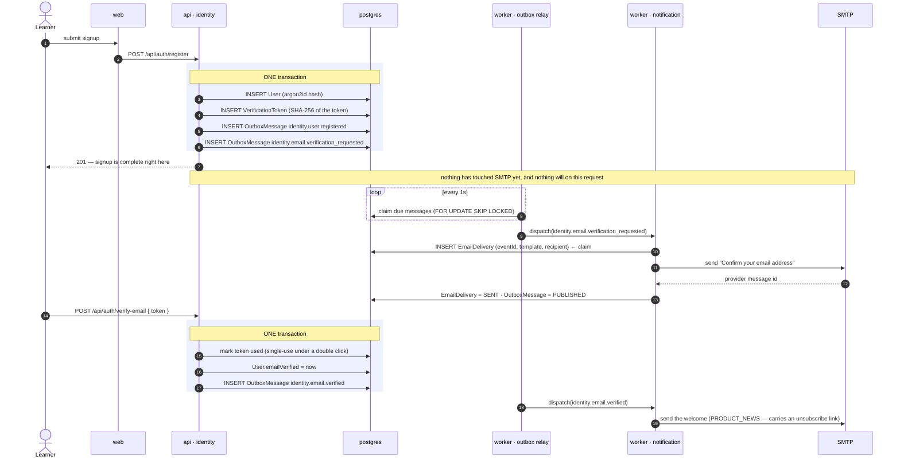
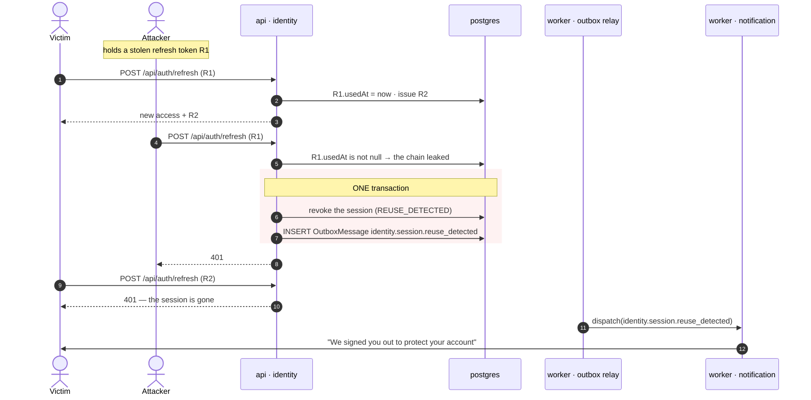
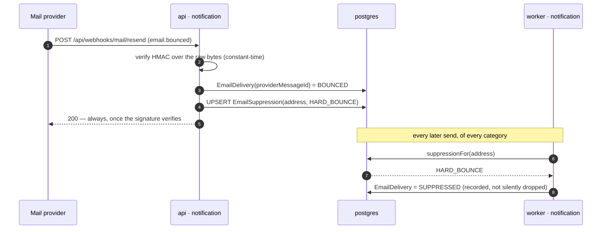
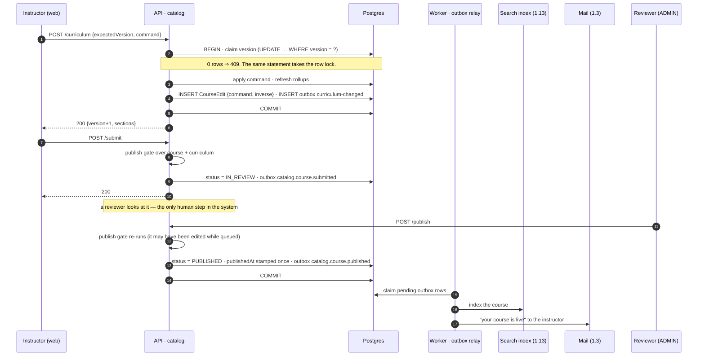
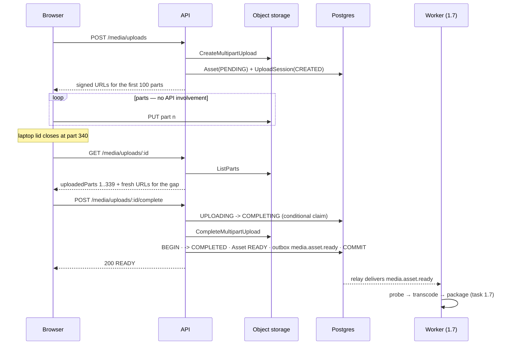
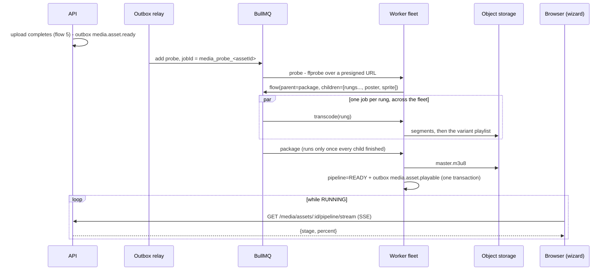

# Data flows — end to end

**Status:** incremental · **Last updated:** 2026-08-22
Covers the flows that exist today. `upload → playable`, `checkout → enrolled` and `playback`
are added as tasks 1.6, 1.7 and 1.9 land — not sketched in advance.

---

## 1. Signup → verified → welcomed

The first flow that crosses a bounded context, and the one every later flow copies.

**What the diagram is arguing.** The 201 comes back before any email exists. A mail outage
delays the verification email; it cannot fail the signup, and there is no state in which an
account exists with no email owed — the outbox rows commit with the user row or not at all.

**The failure path.** If SMTP is down, the delivery row goes `FAILED`, the handler rethrows,
the outbox message stays `PENDING` with `availableAt` pushed forward, and the relay tries
again with exponential backoff. After eight attempts it parks as `DEAD` — retained, not
deleted, so it can be replayed once the cause is fixed.

---

## 2. Refresh rotation, reuse detection, and the alert

The security flow, and the one place two contexts cooperate on an incident.

Revocation and the alert commit together, so there is no state in which a session was killed
for a security reason nobody will ever hear about. Both parties are logged out: at the
moment of detection there is no way to tell attacker from victim, and the safe failure is to
make the human sign in again with something the attacker does not have.

---

## 3. Bounce → suppression

The only flow that starts outside the system.

A hard bounce suppresses the address ahead of every preference and every mandatory
category. The reasoning is not politeness: continuing to send to dead mailboxes is what gets
a sending domain blocklisted, and at that point _nobody_ receives receipts.

Answering 2xx for event types we do not model is deliberate. A 500 on an "opened" event has
the provider redeliver it every few minutes until it gives up on the endpoint entirely,
taking the bounces we do care about with it.

---

## 4. Authoring: draft → reviewed → published

The one flow in the product with a **human in the middle**, and the one where the same
request is made twice from two different tabs.

**What is worth noticing.**

- **The gate runs twice** — on submission and again on approval. A course can be edited
  while it sits in the queue, so approving what a reviewer saw is not the same as publishing
  what it became.
- **`catalog.course.curriculum-changed` is one event for nine kinds of edit.** The search
  indexer needs exactly one message meaning "reindex this"; a per-edit vocabulary would make
  adding an edit type a cross-context change.
- **The version claim is the first statement and it is also the lock**, which is what makes
  two tabs a 409 instead of a lost update. [ADR-0016](../adr/0016-optimistic-concurrency-for-authoring.md).
- **Nothing downstream is awaited.** Indexing and the email are owed, not part of the
  request — same shape as every other flow here.

---

## 5. Resumable upload → asset ready

The only flow in this document where **the data does not pass through the API at all**.

**What is different about this flow.** Everywhere else in this document the API is the thing
that observes the change and then records it. Here the change happens between two systems
the API is not part of, so it cannot observe anything — it can only **ask the provider**. That
inverts the usual rule: our database holds the plan and the lifecycle, and object storage
holds the facts. See [ADR-0017](../adr/0017-provider-truth-for-upload-progress.md).

**What is the same.** The last step is identical to every other flow here — the state change
and the outbox row commit in one transaction, and the pipeline that reacts is a consumer the
producer has never heard of.

## 6. Upload → playable

The longest flow in the system, and the only one where a **human waits with a progress bar**.

**What is different about this flow.** Everywhere else in this document the work finishes
inside a request. Here it takes minutes, on a machine the requester never touches, and the
only thing connecting them is a ratcheted integer in Postgres that the SSE stream polls. The
progress bar is a _projection_ of the DAG, not a channel into it — which is why the worker
collapses five jobs into one percentage rather than the client reassembling them.

**What is the same.** The last step: the state change and the outbox row commit together,
and the pipeline announces its result to consumers it has never heard of.

## 7. The shape all of these share

1. **State and its consequences commit together**, or neither does.
2. **The request returns as soon as the state is durable.** Consequences are owed, not awaited.
3. **Every consequence is idempotent in its own right.** Delivery is at-least-once; effects
   are exactly-once because each handler has a dedupe key it owns — `ProcessedEvent` for the
   handler, `(eventId, template, recipient)` for a send.
4. **Producers do not know their consumers.** Adding one is additive; nothing upstream changes.
