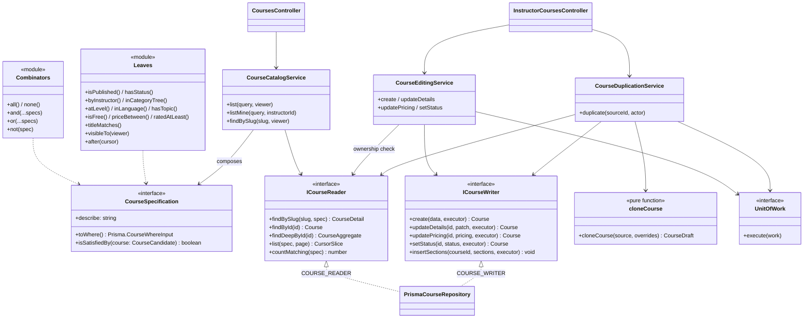
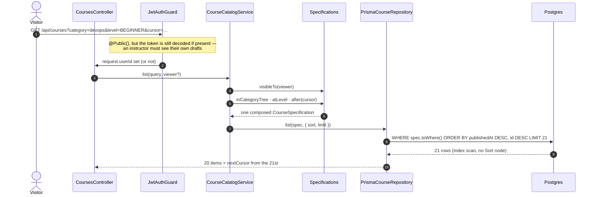
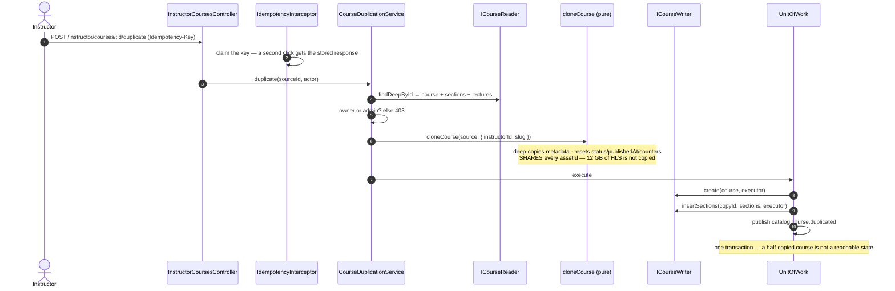

# Catalog — Low Level Design

> **One-liner:** what a course _is_, and how ten thousand of them are found without a
> `switch` and without a sequential scan.

**Module:** `apps/api/src/modules/catalog` · **Status:** built
**Last updated:** 2026-08-23

## 1. Problem

The catalog is the most-read surface in the product and the least uniform. One request wants
"published courses, newest first". The next wants "free beginner Kubernetes courses in
Hindi rated above four, cheapest first, page nine". An instructor wants their own drafts,
which nobody else may see. An admin wants everything.

Written the obvious way that is one `where` object assembled by nine `if` statements inside
one method that grows every sprint — and a visibility rule copied into three query sites,
one of which will eventually be updated and the other two not.

Underneath it is a list, which means pagination, which means the two bugs every list has:
it gets slower the deeper you scroll, and it duplicates or skips rows when someone publishes
a course while you are reading.

## 2. Forces

- **Read volume.** Every visitor hits this before anything else.
- **Filters compose freely.** Nine optional facets is 2⁹ combinations; none can be special-cased.
- **Visibility is a rule about the _viewer_, not the course.** The same row is invisible to a
  stranger, visible to its author, and visible to an admin.
- **Concurrent writes.** Courses are published continuously while people are paging.
- **Money.** A price is an integer in minor units or it is a rounding error waiting for a
  chargeback.
- **Denormalised counters.** Rating and enrollment are written by other contexts and read here.
- **An aggregate with real structure.** Course → Section → Lecture, ordered, with invariants
  that must hold under concurrent edits.
- **Duplication is expensive if done naively.** A course is gigabytes of transcoded video.

## 3. Domain model

`Course` is the aggregate root. `Section` and `Lecture` are **inside** it: they have no
independent lifecycle, are never fetched without their course, and cascade with it. That is
why there is no `SectionRepository` — a repository per table is how a domain goes anemic, and
it would let a caller write a lecture without updating its course's rollup counters.

| Entity     | Invariant                                                                                                           |
| ---------- | ------------------------------------------------------------------------------------------------------------------- |
| `Course`   | `slug` is unique and **never regenerated on rename** — a changed URL is a broken link and a lost ranking.           |
| `Course`   | `publishedAt` is stamped on the **first** publish and never moved. It is the sort key.                              |
| `Course`   | `priceMinor` is an integer in minor units. Razorpay takes integer paise, so no conversion happens at that boundary. |
| `Course`   | `ratingAverage` / `enrollmentCount` are written by other contexts and are **read-only here**.                       |
| `Section`  | `(courseId, position)` is unique **in the database**.                                                               |
| `Lecture`  | `(sectionId, position)` is unique. `assetId` references media and is **shared** across a duplicate.                 |
| `Category` | Two levels: a root has no parent, a child has no children.                                                          |

**Legal states of a course:**

```
DRAFT ──submit──► IN_REVIEW ──publish (ADMIN)──► PUBLISHED
  ▲                   │                              │
  └────withdraw───────┘◄──────unpublish──────────────┘
  └──────────┴──────────────────────────────────────────► ARCHIVED   (terminal)
```

**Delivered in two steps, deliberately.** Task 1.4 enforced exactly one rule — `ARCHIVED` is
terminal — and published the events; writing half a state machine would have meant writing
it twice. **Task 1.5 replaced that guard with the real machine**, added the publish gate,
optimistic-concurrency autosave and the Command-based curriculum editor, and it moved the
diagram above: there is no longer an edge from `DRAFT` straight to `PUBLISHED`, and approval
out of `IN_REVIEW` is reviewer-only. All of it lives in
[`wizard-draft-state.md`](wizard-draft-state.md); this file stops at what a course _is_ and
how it is read.

## 4. Class design



**One class, two tokens.** `PrismaCourseRepository` is bound to `COURSE_READER` and
`COURSE_WRITER` with `useExisting` — not two `useClass` registrations, which would build two
instances of the same repository and quietly split state the moment a caching Decorator wraps
the reader. Interface Segregation is about what a _client_ can reach: the public
`CoursesController` cannot call a write method even by accident, and the search indexer in
task 1.13 will depend on the read half alone.

## 5. Main flow



**The interesting path — an instructor duplicating a course:**



## 6. Patterns used

| Pattern           | Where                                                                    | The force that justified it                                                                                                                                                                 |
| ----------------- | ------------------------------------------------------------------------ | ------------------------------------------------------------------------------------------------------------------------------------------------------------------------------------------- |
| **Specification** | `CourseSpecification` + free-function `and`/`or`/`not` + thirteen leaves | Nine optional facets that combine freely. Inline, that is the query-builder explosion and the `switch` §1 O forbids; here "add a facet" is "add a leaf", with zero edits to the repository. |
| **Repository**    | `ICourseReader` / `ICourseWriter` behind two `Symbol` tokens             | Services must be testable with a fake instead of Postgres (§1 D), and the read half is what gets a caching Decorator in 1.13.                                                               |
| **Prototype**     | `cloneCourse` — a pure function, not a method                            | A course is ~12 GB of transcoded HLS. Deep-copy the mutable metadata; share the immutable assets.                                                                                           |
| **Unit of Work**  | every write runs inside `uow.execute`                                    | The state change and the event describing it commit together, or neither does.                                                                                                              |
| **Observer**      | seven `catalog.course.*` events                                          | Publishing a course must reindex it, invalidate an entitlement cache and email its instructor — three effects that fail independently.                                                      |

**Not used, on purpose.** No `ICourseDuplicator` (one implementation, forever). No
`ISlugGenerator` (a pure function already). No `ISectionRepository` or `ILectureRepository`
(they are inside the aggregate). No `CatalogFacade` (there is no messy subsystem to front
yet; Facade lands with `CheckoutService`). Each of these would be an abstraction with no
second implementation — "one implementation is not a seam", `CLAUDE.md` §3.

## 7. Alternatives rejected

| Option                                                        | Why not                                                                                                                                                                                                                                                                                |
| ------------------------------------------------------------- | -------------------------------------------------------------------------------------------------------------------------------------------------------------------------------------------------------------------------------------------------------------------------------------- |
| **Raw Prisma `where` objects passed around**                  | Filters become untestable without a database, `Prisma.CourseWhereInput` leaks into controller signatures, and every new facet edits `list()`. The visibility rule would live in three places.                                                                                          |
| **An ORM-neutral predicate AST + translator**                 | That is a query builder, written to avoid a dependency ADR-0001 already committed to. The speculative generality §3 forbids. The cost is that `toWhere()` returns a Prisma type — accepted, and guarded by the spec-agreement integration test.                                        |
| **`LIMIT/OFFSET` pagination**                                 | Slower with depth and _wrong_ under concurrent writes. ADR-0015, with the measured pair.                                                                                                                                                                                               |
| **A row-comparison keyset clause**                            | Measurably better — 0.121 ms vs 0.964 ms at page 50 — but Prisma cannot emit `(a, b) < (x, y)`, and its own `cursor` emits an OR-chain over correlated subqueries, which is worse. Shipping the composable form and naming the breaking point is the trade; `docs/db/indexes.md` §6.2. |
| **Money as `Decimal` rupees, or a float**                     | Razorpay's API takes integer paise. Minor units mean no conversion at the one boundary where a rounding error becomes a chargeback.                                                                                                                                                    |
| **Currency as a free ISO-4217 string**                        | Invites `inr` and `INR` in one column with no cheap way to notice. An enum makes it unrepresentable; adding a currency should be a migration.                                                                                                                                          |
| **Many-to-many course ↔ category**                            | Kills the `(status, categoryId, publishedAt)` composite index, and marketplace browse is single-category anyway. One primary category plus a `topics` array covers the loose case.                                                                                                     |
| **Computing `ratingAverage` from a reviews table**            | A join and a sort on every catalog page that no index can rescue. Denormalised, with a reconciliation job owed by task 1.14.                                                                                                                                                           |
| **A partial index `WHERE status = 'PUBLISHED'`**              | Measured **identical** to the shipped composite (0.102 vs 0.105 ms). Rejected because Prisma cannot declare one, so the next `migrate dev` would emit a `DROP` for it as drift — an index the tooling deletes behind your back is worse than none.                                     |
| **`(status, priceMinor)` for the price facet**                | Measured and rejected: 16.9% selectivity is not an index, and the planner never chose it while the main composite existed. Kept in `indexes.md` with its numbers, because a recorded loser is more credible than six indexes that all "helped".                                        |
| **A hard `DELETE` for courses**                               | Would orphan the orders and enrollments arriving in 1.9/1.10. Archiving is the delete; there is no `delete` on the writer interface.                                                                                                                                                   |
| **Returning the raw Prisma row from the authoring endpoints** | `ratingAverage` is a `Decimal`: it serializes as `0` over HTTP but as `{d,e,s}` through a JSON column, so a replayed `Idempotency-Key` returned a _different body_ than the original call. Found by the integration test; fixed with a mapped DTO.                                     |

## 8. Failure modes

| Failure                                         | How it is detected                        | Behaviour                                                     | Recovery                                          |
| ----------------------------------------------- | ----------------------------------------- | ------------------------------------------------------------- | ------------------------------------------------- |
| Stranger requests an unpublished course         | `visibleTo` is part of the `WHERE`        | **404**, never 403 — a 403 confirms the course exists         | —                                                 |
| Cursor tampered, truncated, or from a sort swap | `decodeCursor` validates the sort         | 400 `InvalidCursorException`                                  | Client restarts at page 1                         |
| Course published mid-pagination                 | —                                         | Keyset anchors on the sort key, so no row repeats or vanishes | —                                                 |
| Cursor anchored on an unpublished course        | null sort key → explicit `IS NULL` branch | Paging continues by id                                        | —                                                 |
| Two sections written at the same position       | `(courseId, position)` unique             | Prisma `P2002`                                                | The two-pass reorder — `wizard-draft-state.md` §9 |
| Duplicate fails midway                          | Transaction rolls back                    | No course, no sections, no event                              | Retry; the `Idempotency-Key` makes it safe        |
| Double-clicked "Duplicate"                      | `IdempotencyInterceptor`                  | Stored response replayed; **one** copy exists                 | —                                                 |
| Instructor edits another's course               | Ownership check via `findById`            | 403 `NotCourseOwnerException`                                 | —                                                 |
| Publish on an archived course                   | `COURSE_LIFECYCLE` has no edge out of it  | 409 `IllegalCourseTransitionException`                        | Duplicate it into a fresh DRAFT                   |
| Inverted price range from the UI                | `priceBetween` throws                     | 400, rather than silently returning nothing                   | Fix the caller — the empty list would hide it     |
| Unknown category slug                           | —                                         | Empty list, not a 404                                         | A stale bookmark should not error                 |

## 9. Data & indexes

Tables: `Course`, `Section`, `Lecture`, `Category`. The full ERD is in
[`../db/erd.md`](../db/erd.md); every index, the query it serves and its measured
`EXPLAIN ANALYZE` before/after on 10,000 seeded courses are in
[`../db/indexes.md`](../db/indexes.md).

The headline numbers, all median-of-three against the real schema before and after
migration `20260823030114_catalog_indexes`:

| Query                        | Before   | After        | Index                                             |
| ---------------------------- | -------- | ------------ | ------------------------------------------------- |
| Default catalog list         | 7.838 ms | **0.105 ms** | `(status, publishedAt DESC, id DESC)`             |
| Category browse (hot)        | 4.708 ms | **0.270 ms** | `(status, categoryId, publishedAt DESC, id DESC)` |
| Highest rated                | 6.814 ms | **0.102 ms** | `(status, ratingAverage DESC, id DESC)`           |
| Instructor dashboard         | 4.424 ms | **0.108 ms** | `(instructorId, updatedAt DESC)`                  |
| `title ILIKE '%kubernetes%'` | 9.833 ms | **0.813 ms** | `GIN (title gin_trgm_ops)`                        |
| Course detail (3 statements) | 0.325 ms | 0.370 ms     | already served by the unique constraints          |

The detail row is deliberately included: an unchanged number is evidence that an index was
**not** needed, and recording it is the difference between measuring and decorating.

**Two migrations, on purpose.** `20260822171623_catalog` created the tables with no secondary
index on `Course`; `20260823030114_catalog_indexes` added them. That is what makes the
"before" column a real measurement of a real point in this schema's history rather than a
simulation produced by turning `enable_indexscan` off.

**Transaction boundaries.** Every write — create, update, reprice, status change, duplicate —
runs inside one `uow.execute`, so the outbox rows commit with the state change. The duplicate
writes a course and N sections through the same executor.

## 10. Tests that prove it

**Unit, no database** — 100 tests across four files:

- `and()` of nothing matches everything; `or()` of nothing matches nothing. The identity
  cases a hand-rolled builder always gets wrong.
- `and(a, or(b, c))` keeps its nesting — no over-eager flattening turning AND-of-OR into OR.
- Every leaf, table-driven: `isSatisfiedBy` agrees with what `toWhere` means.
- ⭐ `visibleTo`: anonymous never sees a DRAFT · an owner sees their own · an owner does not
  see someone else's · an admin sees everything. An authorization property, proven with no
  database.
- ⭐ Deep-copy proof: mutate the clone's lecture title, the source is unchanged.
- ⭐ `assetId`s are shared, not regenerated — the deliberate shallow edge, asserted so nobody
  "fixes" it later.
- Every sort's `ORDER BY` ends in the `id` tiebreaker; `nulls: 'last'` on `NEWEST`.
- Duplication writes course and sections through the **same** executor.

**Integration, real Postgres (Testcontainers)** — 47 tests:

- ⭐ `pages 55 rows as 20/20/15 with no gaps and no duplicates`, all sharing one
  `publishedAt` — the test that catches a missing tiebreaker.
- ⭐ `does not repeat a row when a course is published between two pages` — the
  offset-pagination bug, and the evidence for ADR-0015.
- ⭐ `returns exactly the rows the in-memory predicate accepts` — every leaf run both ways
  and compared by id. The guard against the Specification pattern's one real risk.
- ⭐ `creates exactly one copy when the same Idempotency-Key is replayed`.
- `404s a draft for a stranger and 200s it for its owner` — which is what found the guard
  bug below.
- `stamps publishedAt on the first publish and never moves it`.
- `refuses two sections at the same position` (`P2002` — the invariant is in the database).
- `leaves no outbox row when the write inside the transaction fails`.

**Two production bugs the tests found**, both worth recording:

1. `JwtAuthGuard` returned `true` for a `@Public()` route _before_ parsing the token, so
   `request.userId` was never set on the public catalog and `visibleTo` treated every
   signed-in instructor as a stranger. Public routes now identify best-effort.
2. The authoring endpoints returned raw Prisma rows, so a replayed `Idempotency-Key` handed
   back `{d,e,s}` where the original had `0`. Fixed with a mapped DTO in
   `@masternova/shared`.

## 11. Interview notes — 60-second recall

**The problem:** the most-read surface in the product, with nine filters that combine freely,
a visibility rule that depends on the viewer rather than the row, and a list that must not
duplicate rows while people are publishing into it.

**The decision:** filters are **Specifications** — small named objects with two
representations, `toWhere()` for Postgres and `isSatisfiedBy()` for memory, composed by
`and`/`or`/`not`. Adding a facet is adding a leaf; the repository's `list()` was written once
and has never been edited. The payoff is `visibleTo(viewer)`: one object decides what anyone
may see, it is composed **into the SQL**, so an invisible course is a 404 rather than a
200-then-403, and the whole authorization rule is unit-tested with no database.

**The trap in having two representations** is that they drift. The guard is an integration
test that runs every leaf both ways over the same seeded rows and compares the ids.

**Pagination is keyset, not offset**, and the honest version of that story is better than the
slogan. `OFFSET 1000` is slow _and_ wrong under concurrent writes. But I measured my own
implementation: because Prisma can only express the cursor as a disjunction, and a
disjunction cannot be an index _start_ condition, it came out at 0.964 ms against 1.133 ms
for plain `OFFSET` — the clever cursor bought almost nothing on speed. The row-comparison
form is 0.121 ms, and Prisma cannot emit it. So I shipped the composable form for
correctness — it still cannot duplicate or skip a row — wrote the number down, and named the
point where it drops to raw SQL.

**The number:** 10,000 seeded courses, default catalog list **7.838 ms → 0.105 ms**, and the
`Sort` node disappears entirely. And one index measured, beaten, and deliberately **not**
shipped, with its numbers kept.
