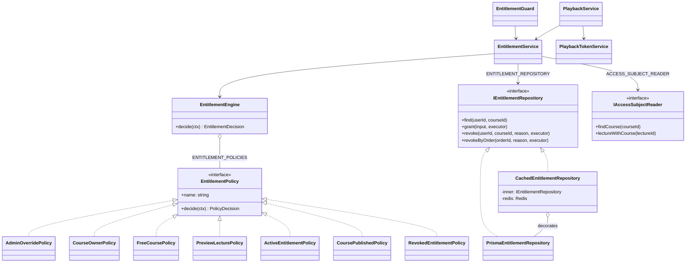
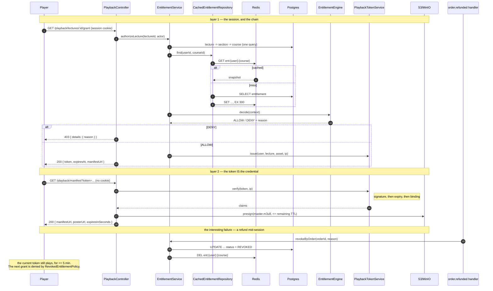

# Entitlement Engine — Low Level Design

> **One-liner:** decides whether one actor may reach one lecture, as an ordered set of
> independently-testable rules where an explicit denial always wins.

**Module:** `apps/api/src/modules/entitlement` · **Status:** built
**Last updated:** 2026-09-03

## 1. Problem

A learner may reach a lecture because they bought the course, because the course is free,
because the lecture is a free preview, because they wrote it, or because they are an
administrator. They may be refused because they never bought it, because they were refunded,
because their access expired, or because the course was pulled from the catalog after they
bought it.

That is nine reasons today and more every quarter — coupons in task 1.11, cohort windows
after that. The question is asked on the hottest path in the application: every playback
start, every quality switch, every progress heartbeat.

## 2. Forces

- **Money.** A wrong `ALLOW` gives away paid content. A wrong `DENY` is a support ticket from
  someone who paid.
- **The rules grow.** Whatever shape this takes, somebody adds a rule to it in three months
  without reading the rest.
- **Refunds must beat everything.** A revocation has to override reasons for access that did
  not exist when the revocation was written.
- **Read-heavy, write-rare.** The entitlement row changes twice in its life and is read
  thousands of times.
- **The credential cannot travel in a header.** A `<video>` element fetching a manifest sends
  no `Authorization`, and cross-origin sends no cookie.
- **Partial failure.** Redis will be unavailable at some point, and playback must survive it.

## 3. Domain model

`Entitlement` is the right to a course's paid content: one row per `(userId, courseId)`,
`ACTIVE` or `REVOKED`, with a nullable `expiresAt` and the `orderId` that paid for it.

**Invariants**

- One row per user–course pair. Enforced by a unique constraint, which is what makes the
  grant an idempotent upsert under at-least-once delivery of `order.paid`.
- `REVOKED` is terminal for that row; a re-purchase re-activates it rather than inserting a
  second one, so a later revoke cannot miss a copy.
- **There is no `EXPIRED` state.** Expiry is a date comparison at decision time. A status
  would need a job to flip it, and between midnight and that job running the table would
  disagree with the clock — in the direction that keeps serving paid content for free.

What the row deliberately does **not** decide: publish state, preview flags, and ownership.
Those are per-request policies, so unpublishing a course rewrites no rows.

## 4. Class design

## 5. Main flow

## 6. Patterns used

| Pattern                     | Where                                                                | The force that justified it                                                                                              |
| --------------------------- | -------------------------------------------------------------------- | ------------------------------------------------------------------------------------------------------------------------ |
| **Chain of Responsibility** | `EntitlementEngine` over `ENTITLEMENT_POLICIES`                      | Ordered rules, any of which may decide or pass. A new rule is a new class plus one line, with no existing rule reopened. |
| **Strategy**                | each `*.policy.ts`                                                   | Many interchangeable rules selected at runtime by what the context contains.                                             |
| **Decorator**               | `CachedEntitlementRepository` wrapping `PrismaEntitlementRepository` | Add caching without the subject or its callers knowing. Removing it is deleting one factory wrapper.                     |
| **Specification**           | `isStaff(context)`                                                   | One named predicate two `DENY` policies both need, composed rather than copied into each.                                |
| **Repository**              | `IEntitlementRepository`, `IAccessSubjectReader`                     | Isolate the domain from Prisma; the engine is tested with neither.                                                       |
| **Facade**                  | `EntitlementService`                                                 | One entry point over reader + engine + repository, so callers never assemble a context by hand.                          |

**Where a pattern was deliberately NOT used.** The engine is a plain class over an injected
array, not a linked list of handlers each holding a `next`. The classic Chain shape exists to
let a handler decide whether to continue; nothing here gets that choice, because every policy
runs. The pointers would be ceremony.

## 7. Alternatives rejected

| Option                                                 | Why not                                                                                                                                                           |
| ------------------------------------------------------ | ----------------------------------------------------------------------------------------------------------------------------------------------------------------- |
| A boolean per rule instead of `ALLOW`/`DENY`/`ABSTAIN` | Forces every rule to invent an answer for cases it knows nothing about. "This is not a preview lecture" is not a reason to deny.                                  |
| First non-abstaining verdict wins                      | Makes the answer depend on array order, so a correct-looking insertion silently defeats a refund.                                                                 |
| `DENY` only if no `ALLOW`                              | The same bug from the other side: a coupon rule added in task 1.11 would out-vote a chargeback.                                                                   |
| Cache the decision                                     | Five invalidation triggers, three of them fan-outs, all living in other bounded contexts. See ADR-0018.                                                           |
| Compute access from a `PAID` order                     | Makes every playback a join into commerce, and has no answer for free courses, admin grants, or a refund that must revoke access the order still records as paid. |
| A JWT for playback                                     | A library, a header nobody reads, and a negotiable `alg`. Five fixed claims do not need it. See ADR-0019.                                                         |
| Re-run the chain on the manifest route                 | Three reads per quality switch, to shorten a revocation window the cache TTL already bounds to the same five minutes.                                             |
| `EntitlementGuard` checks inside each service          | A check somebody can forget to write, whose failure mode is a paid lecture served for free, silently.                                                             |

## 8. Failure modes

| Failure                               | How it is detected              | Behaviour                                          | Recovery                                              |
| ------------------------------------- | ------------------------------- | -------------------------------------------------- | ----------------------------------------------------- |
| Redis unavailable                     | `get`/`set` throws              | Logged; falls through to Postgres                  | Automatic; ioredis reconnects                         |
| Cache invalidation lost (failover)    | Not detected                    | Stale `ALLOW` for at most the 5-minute TTL         | TTL expiry                                            |
| A policy throws                       | Caught per policy in the engine | That rule counts as `DENY`                         | One broken rule is not a 500 on every request         |
| The chain is wired up empty           | —                               | `DENY` — closed by default                         | A deployment mistake cannot open every paid course    |
| `order.paid` delivered twice          | Unique `(userId, courseId)`     | Upsert; one row                                    | No-op                                                 |
| 50 concurrent grants for one purchase | Unique constraint               | One row; losers collide and are no-ops             | Proven in the integration suite                       |
| Refund arrives while a token is live  | —                               | Playback continues to the token's expiry (≤ 5 min) | Accepted; ADR-0019                                    |
| Course archived after purchase        | `CoursePublishedPolicy`         | `DENY` beats the learner's valid entitlement       | Intended — a rights complaint closes it for everyone  |
| Token replayed from another address   | Signature carries the IP        | 401                                                | Client re-requests a grant                            |
| Lecture has no asset yet              | `lecture.assetId` is null       | 401 with a distinct reason, not a denial           | The learner is entitled; the content is not there yet |

## 9. Data & indexes

| Table         | Index                              | Serves                                                                                                         |
| ------------- | ---------------------------------- | -------------------------------------------------------------------------------------------------------------- |
| `Entitlement` | `@@unique(userId, courseId)`       | **The idempotency key** — the upsert target for every redelivered `order.paid`, and the decision's only lookup |
| `Entitlement` | `(userId, status, grantedAt desc)` | The learner's library: "my courses", newest first                                                              |
| `Entitlement` | `(orderId)`                        | Revoking everything one order paid for — the refund path's only query                                          |

**Transaction boundaries.** `grant` and `revoke` take an optional `executor`, so an
entitlement can commit **inside the order's transaction** (task 1.9). An entitlement written
in a separate transaction from the order that paid for it is a dual write, and the window
between them is a learner who paid and cannot watch.

**But the cache is dropped _after_ that commit, never inside it.** A `DEL` issued
mid-transaction is followed by a concurrent read that finds the pre-write row still committed
and re-caches it for the full TTL — so the refund silently keeps working for five minutes,
which is the exact failure the Decorator was added to prevent. Only the transaction's owner
knows when it committed, so `EntitlementService.grantInTransaction` /
`revokeByOrderInTransaction` own the ordering and call `forget()` afterwards.

`revokeByOrder` is a read-then-write — it needs the pairs it touched so the caller can
invalidate them — so it runs in **one transaction**, opening its own when the caller supplied
none. As two statements, a grant for the same order committing in between would be revoked by
the update and missing from the returned list: revoked in the database, still cached as
`ACTIVE`, with nothing left to tell anyone.

**The reads a decision costs.** Two on the learner path — one joined query for
lecture → section → course, and one entitlement lookup that is usually a Redis `GET`. One on
the staff path: `contextFor` skips the entitlement read entirely for an admin or the course's
own instructor, because no policy reads the row for them.

## 10. Tests that prove it

**No database, no Redis** (41 unit tests)

- **`DENY` wins over `ALLOW` regardless of which came first** — asserted by running the same
  two rules in both orders. This is the property the whole design rests on.
- **Closed by default**: every policy abstaining denies, an empty chain denies, and a policy
  that _throws_ denies rather than propagating a 500.
- A refunded learner is locked out **of a free preview lecture** and **of a course that was
  later made free** — the two cases an ordering-based chain gets wrong.
- A course archived after it was sold closes for a learner holding a valid entitlement.
- An unpriced course (`priceMinor = 0`, `priceSetAt = null`) is **not** treated as free.
- Expiry is allowed up to the instant and denied at it; an expired row abstains, so the
  learner can still watch the preview.
- A course-level question ignores preview flags.
- **The playback token**: a token whose lecture id was edited, whose expiry was extended, or
  which was signed with another secret is rejected — the expiry case proving the signature is
  checked before any claim is read. Address binding rejects a replay from elsewhere, and a
  token minted before binding was switched on keeps working.
- **The cache**: negative results are cached, `expiresAt` comes back as a `Date` and not a
  string, invalidation deletes rather than writes through, Redis being down fails neither a
  read nor a revoke, and **a write that joins the caller's transaction does not invalidate**
  — `forget()` is what the transaction's owner calls once it has committed.

**Real Postgres + real Redis + real MinIO** (17 integration tests)

- The guard refuses `/playback/lectures/:id/grant` for a stranger with
  `details.reason = NO_ENTITLEMENT`, and allows it after a grant.
- **A refund revokes across the whole stack**: allowed → `revokeByOrder` → the Redis key is
  gone → denied with `ENTITLEMENT_REVOKED`, including for the preview lecture.
- **Fifty concurrent grants for one purchase produce one row.**
- A revoked row re-activates on re-purchase, with `revokedAt`/`revokedReason` cleared.
- Revoking access nobody has is a no-op, twice.
- **The token round-trips over HTTP**: the grant's `manifestUrl` is fetched **with no
  cookies** and returns a genuinely presigned `master.m3u8` carrying `X-Amz-Signature`.
- A tampered token is 401.
- **`revokeByOrderInTransaction` forgets in the right order**: the key is asserted to still
  be present from _inside_ the transaction and gone once it commits.
- A `grantInTransaction` whose surrounding work throws leaves **no entitlement row** — the
  atomicity that is the whole reason it takes the Unit of Work.
- The grant's `manifestUrl` is **followed exactly as returned** rather than rebuilt, which is
  what catches a URL missing the `/api` prefix.
- An instructor plays their own draft; a learner cannot, and **nothing is cached for staff**.

## 11. Interview notes — 60-second recall

**Problem.** Nine reasons to allow or refuse a lecture, growing every quarter, evaluated on
the hottest path in the app, where a wrong answer is either given-away revenue or a paying
customer locked out.

**Shape.** Seven policies, each returning `ALLOW`, `DENY` or `ABSTAIN` over a context fetched
once. The engine runs **all** of them and reduces: any `DENY` wins, else any `ALLOW`, else
`DENY`.

**The one decision that mattered.** **No short-circuit.** The obvious chain returns the first
non-abstaining verdict — and that makes the answer depend on the order of an array. The rule
that has to win is the refund, and it has to beat reasons for access _that did not exist when
it was written_: a free preview, a course later made free, a coupon somebody adds in task
1.11. Evaluating everything and letting `DENY` win unconditionally means a new rule can never
silently defeat an old one. The price is that a `DENY` policy scopes itself — two of them
consult `isStaff` — and that price is paid once, visibly, in two files.

**The second decision.** **Cache the row, not the decision.** A decision depends on the
entitlement, the publish status, the price and the preview flag, so caching it means five
invalidation triggers living in other bounded contexts. The row has three writers, all
methods on the interface being decorated. ADR-0018.

**Three layers.** Guard on the route → 5-minute HMAC token bound to user + lecture + IP →
CloudFront signed cookie on the segments (Phase 2, seam named in `PlaybackService.manifest`).
A leaked manifest URL is dead in five minutes. The IP binding needs `TRUST_PROXY` on behind a
load balancer — untrusting, Fastify reports the balancer's address for every caller and the
binding blocks nobody while looking like it protects something.

**The number.** Fifty concurrent grants for one purchase → **one row**. And a refund →
the cache key is gone and the next decision is `DENY`, proven against real Redis.

**The seam.** `ENTITLEMENT_POLICIES` — the array in `entitlement.module.ts`. Task 1.11's
coupon rule is a new class and one line, and no existing policy is reopened to add it.
