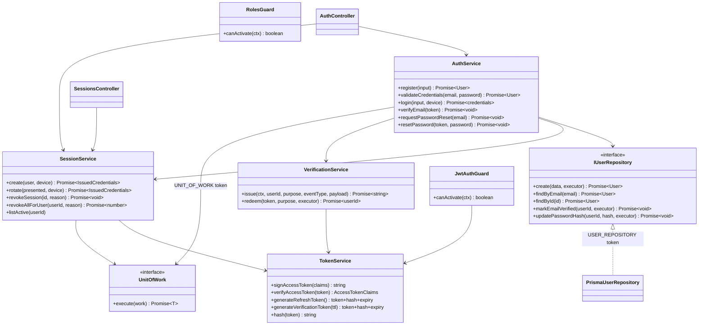
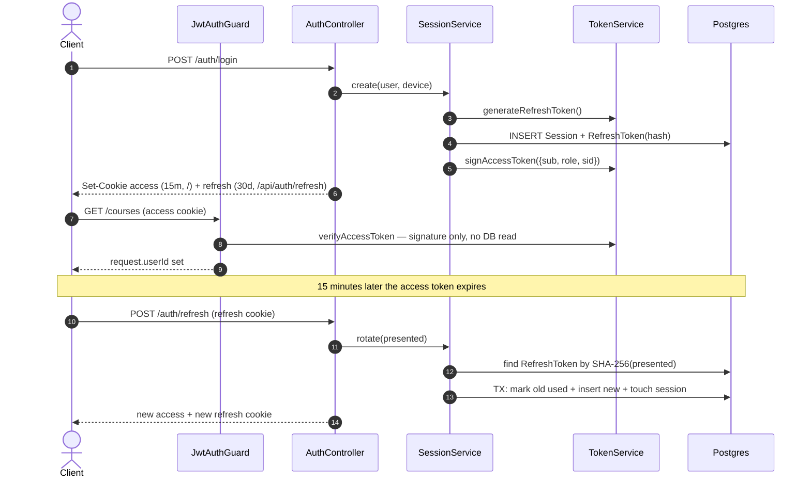
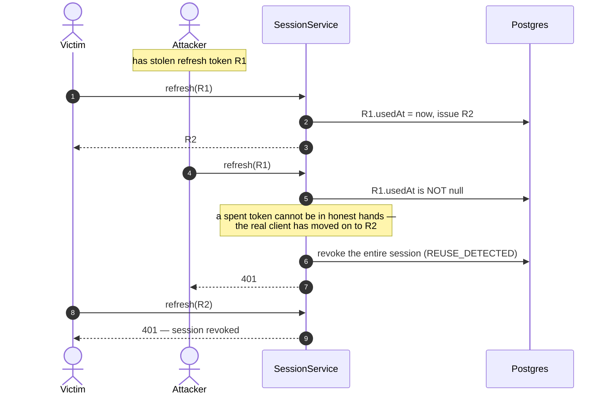

# Identity — Low Level Design

> **One-liner:** proves who someone is, on which device, and makes that proof revocable.

**Module:** `apps/api/src/modules/identity` · **Status:** built
**Last updated:** 2026-08-22

## 1. Problem

Every other module asks the same question first: _who is this request from?_ Answering it
has to be cheap, because it happens on every request, and it has to be **withdrawable**,
because sessions are stolen, laptops are lost, and passwords are reset precisely when
someone believes they are compromised.

Those two requirements pull in opposite directions. A self-contained signed token answers
"who is this" with no database read and cannot be taken back. An opaque token backed by a
row is revocable and costs a lookup on every request. This module is where that trade is
made explicitly instead of by accident.

It is also the module that must never leak. Not the password hashes, not the token hashes,
and not the answer to _"does an account exist for this address?"_ — which is the question
credential-stuffing lists are validated with.

## 2. Forces

- **Hot path.** Authentication runs on every request. A database read per request is a real
  cost at the scale this is designed for.
- **Revocation must be real.** "Sign out my old laptop" and "reset my password" have to
  actually end sessions, or they are theatre.
- **A refresh token is a bearer credential with a long life.** If it leaks, the attacker has
  the account for as long as it lives — and nothing in the protocol tells you it leaked.
- **Multiple actors, one account.** Phone, laptop and a shared machine are separate devices
  whose lifecycles are independent.
- **Enumeration.** Login, registration and forgot-password each have an obvious
  implementation that tells an attacker which addresses exist.
- **Timing is a side channel.** "No such user" returning in 2 ms while "wrong password"
  takes 50 ms leaks the same fact the response body carefully did not.
- **External systems.** Email delivery is involved in verification and reset, and it must
  not be able to fail a signup.

## 3. Domain model

| Entity              | Invariant                                                                                                                       |
| ------------------- | ------------------------------------------------------------------------------------------------------------------------------- |
| `User`              | `email` is unique. `passwordHash` is null **iff** the account is OAuth-only, and such an account can never pass password login. |
| `Session`           | One signed-in device. Revoking one never affects another. Once `revokedAt` is set it is never cleared — revocation is terminal. |
| `RefreshToken`      | One link in a session's chain. At most **one unused** token per session at any time. A used row is **never deleted**.           |
| `VerificationToken` | Single-use and expiring. At most one unused token per `(user, purpose)` — issuing a new one spends the old one.                 |

**Legal states of a refresh token:**

```
issued ──presented once──> used  (terminal; kept forever as evidence)
   │                         │
   │                         └── presented again ──> REUSE: whole session revoked
   └── expires / session revoked ──> unusable
```

Everything interesting about this module is in that second arrow.

## 4. Class design



Four services rather than one, because they change for four different reasons
(`CLAUDE.md` §1 S): `TokenService` changes when the crypto changes, `SessionService` when
the device lifecycle rules change, `VerificationService` when link policy changes, and
`AuthService` when the credential flows change. A single `AuthService` holding all of it
would be the god service §3 forbids.

## 5. Main flow

Happy path first, then the failure path that is the reason this module exists.



**The failure path — a leaked refresh chain:**



Both parties are logged out. That is deliberate: at the moment of detection there is no way
to tell attacker from victim, and the safe failure is to end the session and make the human
sign in again with something the attacker does not have.

## 6. Patterns used

| Pattern          | Where                                                                 | The force that justified it                                                                                                                                                              |
| ---------------- | --------------------------------------------------------------------- | ---------------------------------------------------------------------------------------------------------------------------------------------------------------------------------------- |
| **Repository**   | `IUserRepository` / `PrismaUserRepository` behind `USER_REPOSITORY`   | Services must be testable without a database, and Prisma calls scattered through services is the usual reason a clean-architecture claim collapses under questioning (`CLAUDE.md` §1 D). |
| **Unit of Work** | `register`, `verifyEmail`, `resetPassword` run inside `uow.execute`   | The account and the outbox event describing it must commit together. There must be no state in which a user exists with no verification email owed.                                      |
| **Observer**     | identity publishes events; `notification` consumes them               | Email is an independently-failing effect. Identity sending mail directly would make an SMTP outage able to fail a signup.                                                                |
| **Guard (Nest)** | `JwtAuthGuard` global, opt-out via `@Public()`; `RolesGuard` for RBAC | Authentication is cross-cutting. Making it opt-**out** means a forgotten decorator fails closed (a 401 on a public route) rather than open.                                              |

**Not used, on purpose:** the plan sketched **Strategy** for "auth strategies". There is one
credential flow (password) plus an optional OAuth callback that converges on the same
`User`, so a strategy interface with one real implementation would be the speculative
generality `CLAUDE.md` §3 forbids. It becomes a Strategy the day a second real mechanism
(SAML, magic link) exists.

## 7. Alternatives rejected

| Option                                                | Why not                                                                                                                                                 |
| ----------------------------------------------------- | ------------------------------------------------------------------------------------------------------------------------------------------------------- |
| **Stateless JWT access + long-lived JWT refresh**     | Unrevocable. Signing out one device is impossible, and a leaked refresh token is valid until expiry with no signal that it leaked. See ADR-0010.        |
| **Opaque access token + Redis lookup per request**    | Fully revocable, but adds a network hop to _every_ request forever, to shorten a 15-minute window. The window is a cheaper price than the hop.          |
| **Refresh token as a JWT**                            | Then revocation needs a denylist — which is the database read a JWT was supposed to avoid, with extra steps. An opaque token is the denylist, inverted. |
| **Deleting the old refresh token on rotation**        | Removes the only evidence of reuse. You cannot detect the replay of a row you deleted.                                                                  |
| **Revoking only the replayed token, not the session** | The attacker just refreshes again with the newest token. Reuse means the chain is compromised, not one link.                                            |
| **argon2 for refresh/verification token hashes**      | Those are 256-bit random values — there is nothing to brute-force. It would look more careful and only add latency to every refresh.                    |
| **`@fastify/secure-session` (what Phase 0 shipped)**  | Server-stateless encrypted cookie: unrevocable, and signing out on one device left every other cookie valid. Replaced in this task.                     |
| **404 on forgot-password for unknown addresses**      | Turns the reset form into an account-enumeration oracle.                                                                                                |

## 8. Failure modes

| Failure                                        | How it is detected                            | Behaviour                                                                                                                                    | Recovery                                                 |
| ---------------------------------------------- | --------------------------------------------- | -------------------------------------------------------------------------------------------------------------------------------------------- | -------------------------------------------------------- |
| Refresh token replayed                         | `usedAt` non-null on the presented token      | Whole session revoked (`REUSE_DETECTED`), 401 to both parties                                                                                | User signs in again; a security email follows (task 1.3) |
| Access token stolen                            | Not detectable — it is a bearer token         | Valid until expiry, **max 15 minutes**                                                                                                       | Revoking the session stops the next refresh              |
| Password reset by an attacker with an old link | Token is single-use and expiring              | Second redemption fails                                                                                                                      | Issuing a new link spends the previous one               |
| Double-clicked verification link               | Two concurrent `updateMany … usedAt: null`    | Exactly one updates a row; the other gets `count = 0` and a 400                                                                              | None needed — this is the intended behaviour             |
| Email provider down                            | Outbox message fails and retries with backoff | **Signup still succeeds.** The event is durable and delivers later                                                                           | Relay retries; message parks as `DEAD` after 8 attempts  |
| Database down during login                     | Prisma throws                                 | 500 via `AllExceptionsFilter`; no partial session                                                                                            | Session creation is a single insert — nothing to unwind  |
| Account enumeration attempt                    | —                                             | Login, register-conflict and forgot-password answer indistinguishably; a missing password still runs a dummy argon2 verify so timing matches | —                                                        |

## 9. Data & indexes

| Table               | Indexes                                                | The query it serves                                        |
| ------------------- | ------------------------------------------------------ | ---------------------------------------------------------- |
| `User`              | `email` unique · `role`                                | Login lookup; admin filtering by role                      |
| `Session`           | `(userId, revokedAt)`                                  | "Your devices" list; revoke-all                            |
| `RefreshToken`      | `tokenHash` unique · `sessionId` · `expiresAt`         | Rotation is a single unique lookup; expiry sweeps          |
| `VerificationToken` | `tokenHash` unique · `(userId, purpose)` · `expiresAt` | Redemption by hash; spending the previous token on reissue |

**Transaction boundaries.** `register` (user + outbox rows), `verifyEmail` (redeem + mark
verified + event), `resetPassword` (redeem + new hash + event) each run in one Unit of Work.
`rotate` runs its own three-statement `$transaction`: marking a token used and minting its
replacement must be atomic, or a crash between them strands the client with a spent token or
leaves two live tokens in one chain.

Nothing outside `identity` may read these tables. Consumers get what they need on the event
payload — a consumer that calls back into the producer has re-coupled what the event
decoupled.

## 10. Tests that prove it

`apps/api/test/identity.int-spec.ts` — 27 assertions against real Postgres (Testcontainers):

- **`detects refresh-token reuse and kills the entire session`** ⭐ — replays a spent token
  and asserts that the _victim's freshly-rotated_ token is dead too. This is the test the
  module exists for.
- `rotates the refresh token, issuing a different one each time` — proves rotation, not just refresh.
- `revokes only the current device on logout, leaving others signed in` — session isolation.
- `resets the password and revokes every existing session` — the reset is not theatre.
- `verifies an email with the token carried on the outbox event` — proves identity sends no
  mail: the test reads the token off the outbox row.
- `answers forgot-password identically for known and unknown addresses` — enumeration.
- `registers, publishing the events that notification will react to` — the seam for task 1.3.
- `authenticates /auth/me by cookie and rejects it without one` — the global guard fails closed.

## 11. Interview notes — 60-second recall

**The problem:** authentication must be cheap on every request _and_ revocable. Those fight.

**The decision:** split the credential in two. A 15-minute signed JWT answers "who is this"
with no database read. A 30-day **opaque** refresh token — a random 256-bit value, stored
SHA-256 hashed — is a lookup key into a `Session` row we control, so revocation is real.
The access-token TTL _is_ the revocation window, and 15 minutes is the price paid to keep a
Redis hop off every request.

**The thing worth talking about:** refresh **rotation with reuse detection**. Every refresh
mints a new token and marks the old one _used_ — and used rows are kept, never deleted,
because you cannot detect the replay of a row you removed. A spent token arriving again
means the chain leaked: the honest client has already moved on. You cannot tell attacker
from victim, so you revoke the whole session and make the human sign in again.

**Two details that show care:** SHA-256 for the refresh token and argon2id (explicit OWASP
parameters, not library defaults) for the password — because a 256-bit random value has
nothing to brute-force and a slow hash there only buys latency. And a missing password still
runs a dummy argon2 verify, so the timing does not leak what the response body carefully
does not.

**The number:** 27 integration tests on real Postgres; the load-bearing one asserts that
after a replay, the victim's _newest_ token is dead too.
