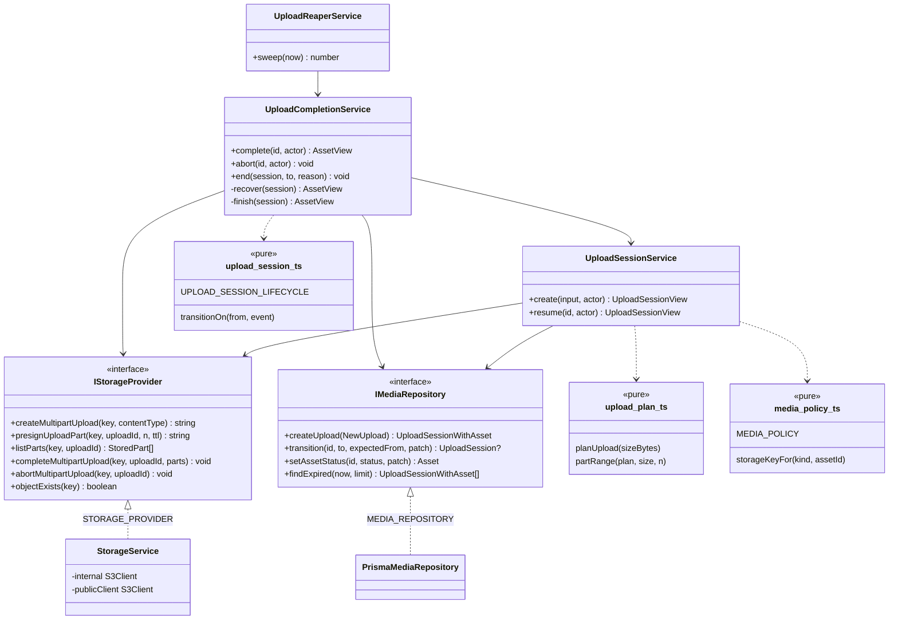
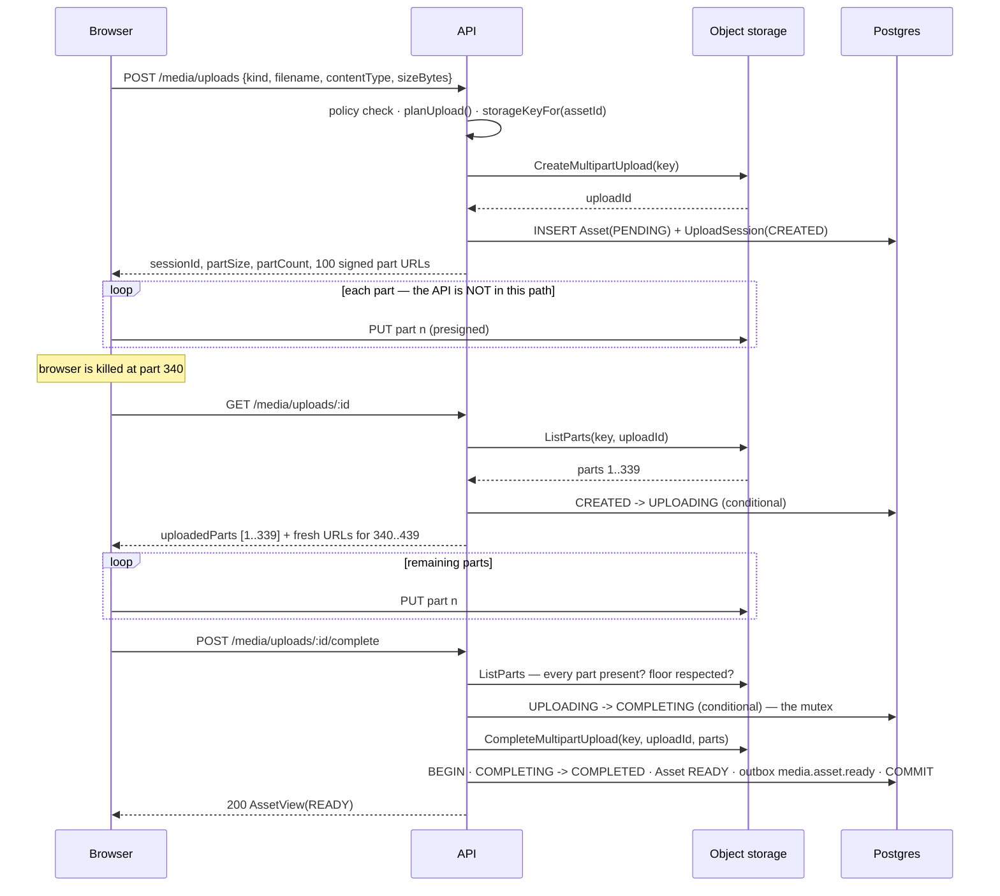

# Media — Low Level Design

> **One-liner:** gets a file from a browser into object storage without the API ever
> touching a byte, and survives the client dying halfway through.

**Module:** `apps/api/src/modules/media` · **Status:** built
**Last updated:** 2026-09-02

## 1. Problem

An instructor uploads a 10 GB lecture recording from a laptop on hotel wifi. That will not
survive a single HTTP request, and it must not occupy an API process while it happens —
one upload would pin a Node worker for an hour and a body-size limit would reject it long
before that. Multipart splits the file, and presigned URLs let the browser send each part
straight to object storage. The interesting question is not the split. It is: **after the
browser is killed at part 340 of 1250, how does it find out that 339 landed?**

## 2. Forces

| Force                            | Where it bites                                                                                                                                       |
| -------------------------------- | ---------------------------------------------------------------------------------------------------------------------------------------------------- |
| **The API is not in the path**   | Parts go browser → S3 directly. We never observe one landing, so anything we record about progress is a guess written by a process allowed to crash. |
| **Partial failure**              | The client dies mid-transfer. Every recovery decision has to be derivable from the provider, not from our own bookkeeping.                           |
| **`Complete` is not idempotent** | A second `CompleteMultipartUpload` returns `NoSuchUpload` — indistinguishable from "never started". A naive retry turns a success into a 500.        |
| **Three racing actors**          | The browser completing, the instructor cancelling in another tab, and the reaper expiring — none can see the others.                                 |
| **Invisible cost**               | Abandoned multipart parts are billed and do **not** appear in a bucket listing. A closed tab leaks 10 GB with no evidence but the monthly invoice.   |
| **Untrusted input**              | The filename, the declared size and the content type all come from the client.                                                                       |

## 3. Domain model

Two tables, deliberately, because they have different lifetimes:

- **`Asset`** — the durable file. Referenced by `Lecture.assetId` for years; task 1.7
  attaches renditions to it. `PENDING → READY | FAILED`.
- **`UploadSession`** — the transfer protocol. Lives hours, then stops mattering. Folding
  them together would leave a lecture joining to `partSize` long after the upload ended.

**Invariants**

- An asset is `READY` only after the provider has confirmed the assembled object exists.
- Exactly one `media.asset.ready` is ever raised per asset, in the same transaction as the
  state change that earned it.
- `ARCHIVED`-equivalent terminals (`COMPLETED`, `ABORTED`, `EXPIRED`) are terminal: no
  event moves a session out of them.
- The storage key is fixed before the first byte moves, and contains nothing the user typed.

**There is deliberately no parts table.** It would be a second copy of a fact only the
provider knows, written by a client that may die at any moment — and the two would disagree
exactly during the resume the rows were supposed to enable. `ListParts` is the truth.

## 4. Class design

## 5. Main flow

The happy path, then the failure that shaped the design.

**The failure path that matters.** If the process dies between
`CompleteMultipartUpload` succeeding and the transaction committing, the session is stuck
in `COMPLETING` and retrying the assemble teaches us nothing — the provider answers
`NoSuchUpload` whether it already succeeded or never ran. So recovery asks a different
question: `objectExists(key)`. Yes → the bytes are there, finish the bookkeeping. No → the
assemble never landed, release to `UPLOADING` and let the client retry.

## 6. Patterns used

| Pattern        | Where                                            | The force that justified it                                                                                                                                                                        |
| -------------- | ------------------------------------------------ | -------------------------------------------------------------------------------------------------------------------------------------------------------------------------------------------------- |
| **Adapter**    | `IStorageProvider` ← `StorageService` (S3/MinIO) | A third-party API is not our domain interface. Two real implementations exist today (MinIO in dev, S3 in prod) plus a third in prospect, so the seam is not speculative.                           |
| **State**      | `upload-session.ts`                              | Three actors race for one row and none can see the others. Without a machine, the reaper expires a session in the same second the browser completes it, and a paid lecture's media reads `FAILED`. |
| **Repository** | `IMediaRepository` ← `PrismaMediaRepository`     | Conditional transitions need `updateMany`-with-`where`, which is a persistence detail no service should express.                                                                                   |
| **Observer**   | `media.asset.ready` → outbox                     | Transcoding, captions (1.16) and search indexing (1.13) are independently-failing effects of one cause. Media must not know any of them exist.                                                     |

**Deliberately absent: a Strategy for part sizing.** There is one sizing rule and no second
one planned. `planUpload` is a pure function; a strategy interface over it would be the
speculative generality CLAUDE.md §3 forbids.

## 7. Alternatives rejected

| Option                                                       | Why not                                                                                                                                                                                                                           |
| ------------------------------------------------------------ | --------------------------------------------------------------------------------------------------------------------------------------------------------------------------------------------------------------------------------- |
| **Client sends back its ETags at complete**                  | What the AWS SDK's own uploader does. It makes the client the authority on what landed — and a client that lost its tab has no list to send. `ListParts` costs one call and works for a client that knows only its session id.    |
| **A `upload_parts` table**                                   | A dual write against a fact only the provider observes, maintained by a process allowed to crash. It would disagree with reality precisely during a resume.                                                                       |
| **Proxy the bytes through the API**                          | One 10 GB upload pins a Node process for an hour, and every byte is paid for twice in bandwidth. Presigned URLs remove the API from the data path entirely.                                                                       |
| **No `COMPLETING` state — transition straight to COMPLETED** | Tried, and it failed the ten-concurrent-completes test: all ten reached the provider, one succeeded and nine got `NoSuchUpload` 500s for an upload that had worked. Claiming before the provider call is the fix.                 |
| **Recover any `COMPLETING` session on sight**                | Also tried, also failed the same test: concurrent retries released the claim of the request that was actively assembling, and the winner then found its session moved. Recovery is gated behind a two-minute grace.               |
| **A class per state**                                        | Five states × six events is thirty methods, most of them `throw`. The interesting content is the edge list; burying it in method bodies makes "what can happen next?" the hardest question to answer. Same argument as `catalog`. |
| **Bucket creation on boot**                                  | Removed. It requires `s3:CreateBucket` in production — a permission a media service has no business holding — and it turns a typo in `S3_BUCKET` into a silently-created empty bucket. Provisioning is infrastructure's job.      |
| **Exact division for part size** (`ceil(size / 10000)`)      | Gives the smallest legal part size and an unaligned number like 8 388 609 that no client buffer matches. Doubling keeps every size a power-of-two multiple of the default, so resumed boundaries stay predictable.                |

## 8. Failure modes

| Failure                                  | How it is detected                            | Behaviour                                                 | Recovery                                                 |
| ---------------------------------------- | --------------------------------------------- | --------------------------------------------------------- | -------------------------------------------------------- |
| Client dies mid-transfer                 | `ListParts` on the next status call           | Session moves to `UPLOADING`; response names the gap      | Client PUTs only the missing parts                       |
| Presigned URL expired (1 h)              | Provider rejects the PUT                      | —                                                         | The same status call re-signs; no separate code path     |
| Client never returns                     | `expiresAt` passes                            | Reaper claims the row, then aborts the multipart upload   | Asset `FAILED`, `media.asset.failed` raised              |
| Process dies mid-assemble                | Session found `COMPLETING` and stale (>2 min) | `objectExists` decides: finish, or release to `UPLOADING` | Client retry succeeds either way                         |
| Ten concurrent completes                 | Conditional transition to `COMPLETING`        | One 200, nine 409                                         | One asset, one event — asserted by test                  |
| Complete races an abort                  | Conditional transition on both sides          | Loser changes nothing                                     | A completed upload's asset is never marked `FAILED`      |
| Short middle part                        | `ListParts` sizes checked before the assemble | 409 naming the part number                                | Client re-sends that part                                |
| Provider unreachable during reaper abort | Exception from `abortMultipartUpload`         | Logged; the row stays claimed                             | Parts reclaimed by the bucket's multipart lifecycle rule |
| Lying `sizeBytes`                        | Plan cannot be filled                         | Complete refuses, naming the missing parts                | —                                                        |

## 9. Data & indexes

| Table           | Index                       | Serves                                                 |
| --------------- | --------------------------- | ------------------------------------------------------ |
| `Asset`         | `@@unique(storageKey)`      | The key is identity; a collision is a bug, not a retry |
| `Asset`         | `(ownerId, createdAt desc)` | The instructor's media library                         |
| `Asset`         | `(status)`                  | Sweeping assets whose upload never finished            |
| `UploadSession` | `@@unique(assetId)`         | One session per asset, enforced by the database        |
| `UploadSession` | `(status, expiresAt)`       | The reaper's queue — live sessions past expiry         |
| `UploadSession` | `(ownerId, createdAt desc)` | An instructor's in-flight uploads                      |

**Transaction boundaries.** Exactly one transaction, in `finish()`: the session transition,
the asset flip to `READY`, and the outbox row commit together. An asset marked `READY` with
no `media.asset.ready` in the outbox is a lecture that never gets transcoded — invisible
until a learner presses play. Every provider call happens **outside** a transaction: holding
a database connection open across a network round trip to S3 is how a connection pool dies
under load.

`sizeBytes` is `BigInt`. A 4 GB recording overflows INT4's 2 147 483 647, and the failure
would be a silently truncated size rather than a loud error. It crosses the wire as a
decimal string, because `JSON.stringify` throws on a BigInt.

## 10. Tests that prove it

**No database** (`upload-plan.spec.ts`, `upload-session.spec.ts` — 35 tests)

- The parts **tile the file exactly** at 1 byte, at a part boundary, one past it, and at 1 GiB — no gap, no overlap. A plan that loses a byte produces a video that transcodes fine and fails halfway through playback.
- Every plan is provider-legal from 1 byte to the 40 TiB ceiling: part count ≤ 10 000, part size ≤ the limit, non-final parts ≥ 5 MiB.
- `COMPLETED` refuses **every** event — the reaper-versus-completion bug, asserted directly.
- `COMPLETING` accepts neither `abort` nor `expire`: both would destroy an assemble in flight.
- No path offers a transition the source state did not declare.

**Real Postgres + real MinIO** (`test/media.int-spec.ts` — 26 tests)

- **Resume:** PUT part 1, "die", then `GET` reports `uploadedParts: [1]` and re-signs only part 2. The upload then completes. Parts are PUT to MinIO with `fetch`, not through the app — so "the API is not in the data path" is under test too.
- **Ten concurrent completes → exactly one 200, nine 409, one asset, one outbox event.**
- **Crash recovery:** an object assembled out of band with the row left `COMPLETING` and stale → the retry returns `READY` and raises exactly one event. With no object → released to `UPLOADING`, and the next retry succeeds.
- **In-flight claim is not stolen:** a fresh `COMPLETING` gets a 409 and is left untouched.
- **Reaper never reaps a completed upload** — the asset stays `READY`.
- A short middle part is rejected with its part number, before the assemble.
- Another instructor's session is a 404, not a 403.
- **Declared size is enforced:** an upload created for 1 KB that receives 3 MB is refused, and the asset stays `PENDING`. Without this the per-kind caps mean nothing.
- **A released claim still completes:** the object exists, the session was released to `UPLOADING` by a racing retry, and the request that did the work still finishes and raises exactly one event.
- **A stranded `COMPLETING` session is swept** — the one state nothing else could reach.
- **Polling a session mid-assemble returns 200, not 500** — status is answered without touching the provider.
- **The sweep counts only what it claimed**, so N replicas do not each report the full batch.

## 11. Interview notes — 60-second recall

**Problem.** A 10 GB lecture over bad wifi, and the API must never see a byte of it.

**Shape.** Browser gets presigned part URLs and PUTs straight to S3. Progress and resume are
the same endpoint, and it answers from `ListParts` — never from our own records, because the
API is not in the data path and anything we wrote would be a guess by a process allowed to
crash.

**The one decision that mattered.** `CompleteMultipartUpload` is **not idempotent** — the
second caller gets `NoSuchUpload`, which is indistinguishable from "never started". So the
session is claimed into a `COMPLETING` state _before_ the provider call, and that conditional
transition is the mutex. And because a crash can leave a session in `COMPLETING` with the
object already assembled, recovery asks `objectExists` rather than retrying the assemble —
gated behind a two-minute grace so a concurrent retry cannot steal a live claim.

**The number.** Ten concurrent completes → **one 200, nine 409, one asset, one event.**
Both wrong orderings were caught by that test, not by review: assembling before claiming gave
nine 500s, and recovering eagerly gave zero successes.

**The seam.** `IStorageProvider` — MinIO in dev, S3 in prod, no method that either one has to
throw `NotSupportedError` for. And `media.asset.ready`, which is where the whole 1.7 pipeline
attaches without this module knowing it exists.
