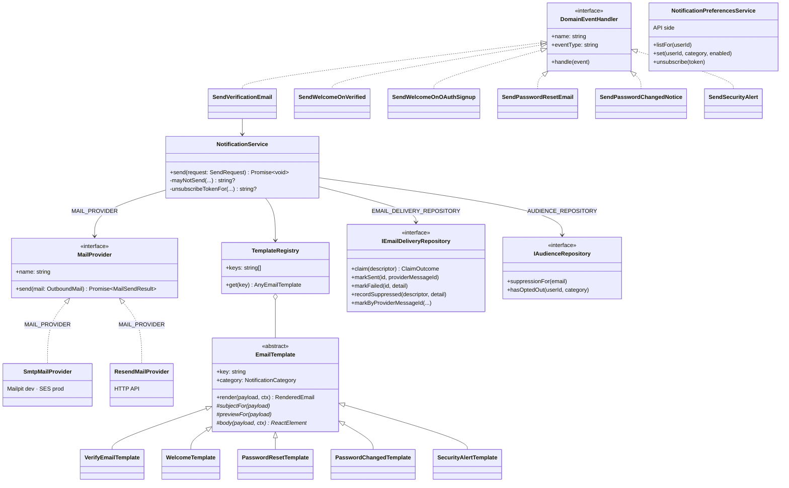
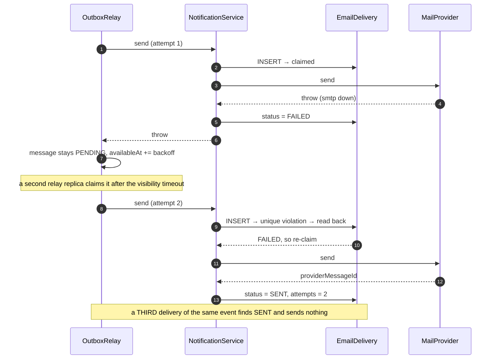

# Notification — Low Level Design

> **One-liner:** turns a domain event into exactly one consented, rendered email, and never
> lets a mail outage fail the transaction that caused it.

**Module:** `apps/worker/src/modules/notification` (send) ·
`apps/api/src/modules/notification` (consent) · **Status:** built
**Last updated:** 2026-08-22

## 1. Problem

Sixteen things in this product need to send an email: verify your address, reset your
password, here is your receipt, your transcode failed, someone answered your question. All
sixteen are consequences of something else — a signup, a payment, a job — and none of them
may be allowed to fail the thing they are a consequence of.

That is the easy half. The hard half is everything around the send. The same event will be
delivered more than once, because the outbox guarantees at-least-once, and a user who gets
two password-reset emails calls support. Some categories are opt-out and some are not, and
getting that backwards means either spamming people or hiding a receipt behind a preference
they switched off two years ago. And an address that hard-bounces has to stop receiving
mail **globally and immediately**, because continuing to send to dead mailboxes is what
gets a sending domain blocklisted — at which point nobody gets receipts, not just that one
user.

## 2. Forces

- **Partial failure.** SMTP is a system we do not control, and it is down sometimes.
- **Retries.** The outbox redelivers. Every handler here runs more than once.
- **Consent is not uniform.** A receipt and an announcement are not the same thing, and
  treating them the same is either dishonest or illegal depending on jurisdiction.
- **Deliverability is a shared resource.** One user's bounces degrade everyone's mail.
- **Two deployables, one context.** Sending is a background loop; changing a preference is
  a request. They have different lifecycles and different failure modes.
- **Rendering is a client-compatibility problem**, not a templating problem. Outlook renders
  through Word; Gmail strips `<style>` on forward; a missing plaintext part scores as spam.
- **Prefetching.** Mail clients and corporate scanners fetch every link in a message before
  a human sees it.

## 3. Domain model

| Table                    | Invariant                                                                                                                                        |
| ------------------------ | ------------------------------------------------------------------------------------------------------------------------------------------------ |
| `EmailDelivery`          | `(eventId, template, recipient)` is unique. One row **is** one email; its existence in a terminal state means that email will not be sent again. |
| `EmailSuppression`       | Keyed by address. Its presence forbids every send to that address, of every category, including mandatory ones.                                  |
| `NotificationPreference` | `(userId, category)`. **Absent means subscribed** — a new account needs no rows, and a new category defaults to on.                              |

**Legal states of a delivery:**

```
              ┌──────────────┐
  (claim) ───►│   SENDING    │───success──► SENT ──webhook──► BOUNCED / COMPLAINED
              └──────┬───────┘                                (terminal)
                     │ provider error
                     ▼
                  FAILED ──redelivery──► SENDING   (retried by the outbox, not by us)

  (refused) ──► SUPPRESSED   (terminal — a deliberate non-send, recorded not dropped)
```

`SENDING` older than five minutes is treated as abandoned and reclaimed. Five minutes is
not arbitrary: it is the outbox relay's visibility timeout, so it is the longest a healthy
sender can legitimately hold a message.

**The category rules** — the product decision, stated once so it cannot drift:

| Category           | Mandatory? | Why                                                     |
| ------------------ | ---------- | ------------------------------------------------------- |
| `ACCOUNT_SECURITY` | yes        | Verification, reset links, "your password changed"      |
| `PURCHASE`         | yes        | Receipts, refunds, enrollment — part of the transaction |
| `COURSE_ACTIVITY`  | no         | Transcript ready, transcode failed, published           |
| `ENGAGEMENT`       | no         | Reviews, Q&A                                            |
| `PRODUCT_NEWS`     | no         | Announcements, and the welcome email                    |

The welcome email is `PRODUCT_NEWS` on purpose. It is onboarding, not something the user
asked for, so it carries a real unsubscribe link at the first possible moment.

## 4. Class design



The six handlers are separate classes rather than one table-driven handler because
`DomainEventHandler.name` is the dedupe key in `ProcessedEvent`. A class per mapping means
each is registered, retried and skipped independently — so adding "receipt on order paid"
in task 1.9 cannot replay "verify your email" for every historic signup.

## 5. Main flow

```mermaid
sequenceDiagram
    autonumber
    participant ID as identity (api)
    participant OB as OutboxMessage
    participant RL as OutboxRelay (worker)
    participant H as SendVerificationEmail
    participant NS as NotificationService
    participant AU as AudienceRepository
    participant T as VerifyEmailTemplate
    participant DL as EmailDelivery
    participant MP as MailProvider

    ID->>OB: INSERT in the SAME txn as the user row
    Note over ID,OB: signup has already succeeded; email is owed, not awaited
    RL->>RL: claim (FOR UPDATE SKIP LOCKED)
    RL->>H: dispatch(identity.email.verification_requested)
    H->>NS: send({ eventId, template, to, userId, payload })
    NS->>AU: suppressionFor(recipient)
    AU-->>NS: null
    NS->>AU: hasOptedOut? (optional categories only)
    NS->>T: render(payload, ctx) → subject + html + text
    NS->>DL: INSERT (eventId, template, recipient)  ← the claim
    DL-->>NS: claimed
    NS->>MP: send(mail)
    MP-->>NS: providerMessageId
    NS->>DL: status = SENT
    RL->>OB: status = PUBLISHED
```

**The interesting failure path — the same event arrives twice, and the provider is down:**



## 6. Patterns used

| Pattern             | Where                                                                | The force that justified it                                                                                                                                                         |
| ------------------- | -------------------------------------------------------------------- | ----------------------------------------------------------------------------------------------------------------------------------------------------------------------------------- |
| **Adapter**         | `SmtpMailProvider`, `ResendMailProvider` behind `MAIL_PROVIDER`      | A third-party API is not our domain interface. One holds a pooled TCP connection and returns a Message-ID; the other is a stateless HTTPS POST returning a JSON id.                 |
| **Template Method** | `EmailTemplate.render` — subject → body → shared layout → plaintext  | The skeleton is fixed and exactly one step varies. Leaving it to each template means the day someone forgets the plaintext part, one email renders blank in a client nobody tested. |
| **Observer**        | six `@EventHandler()` classes reacting to identity events            | One cause, many independently-failing effects. Identity does not know notification exists, and a mail outage therefore cannot fail a signup.                                        |
| **Registry**        | `TemplateRegistry.get(key)`                                          | Same force as Factory Method: choose an implementation from a discriminator. A lookup rather than a `switch`, so adding a template edits no existing code.                          |
| **Repository**      | `IEmailDeliveryRepository`, `IAudienceRepository`, and the API's two | The pipeline's rules are decisions, not queries. Proving "suppression outranks a receipt" must not need Postgres.                                                                   |

**Not used, on purpose:** the plan sketched an **Abstract Factory** for channel families
(email / in-app / future SMS). There is one channel. An abstract factory with one concrete
family is precisely the speculative generality `CLAUDE.md` §3 forbids — "one implementation
is not a seam" — and it would have to be defended in an interview with "for later", which
is not a force. In-app notifications arrive with `engagement` (task 1.14); the factory
arrives with them, shaped by two real families instead of one imagined one. Recorded as a
deliberate deviation in `BUILD_PLAN.md` §2.2, the same way `BaseJobProcessor` was.

**Kernel change this task forced.** `DOMAIN_EVENT_HANDLER` was a multi-provider injection
token. Nest's `multi` providers do not merge across modules, so the second bounded context
to register handlers would have silently shadowed the first — and making it work at all
required `outbox-relay` to import `notification`, which `CLAUDE.md` §4 forbids outright.
Handlers are now marked `@EventHandler()` and found through Nest's `DiscoveryService`. The
dispatcher never learns which contexts exist, and adding a consumer edits no kernel file
(§1 O). `docs/lld/platform-kernel.md` was updated in the same commit.

## 7. Alternatives rejected

| Option                                                  | Why not                                                                                                                                                                                                                                                                                     |
| ------------------------------------------------------- | ------------------------------------------------------------------------------------------------------------------------------------------------------------------------------------------------------------------------------------------------------------------------------------------- |
| **Send inline from identity/commerce**                  | An SMTP outage would fail a signup and a checkout. This is ADR-0004's whole argument, applied.                                                                                                                                                                                              |
| **A retry loop inside `NotificationService`**           | The outbox already has backoff, an attempt cap and a dead-letter state. A second retry mechanism inside the first means two counters that disagree about how many attempts happened.                                                                                                        |
| **Dedupe only on `ProcessedEvent`**                     | That protects against redelivery of an event, not against two relay replicas racing on one message past its visibility timeout. The unique key on the delivery row is the layer that survives that, and the two are independently tested.                                                   |
| **Insert the delivery row after sending**               | A crash in the gap sends the email again on retry. Claiming first makes the database arbitrate, and exactly one INSERT can win.                                                                                                                                                             |
| **A token table for unsubscribe links**                 | A table that only ever grows, for a capability whose worst-case abuse is unsubscribing a stranger from course announcements. An HMAC gives the same authenticity with nothing to store, and rotating one secret revokes every outstanding link.                                             |
| **`GET /unsubscribe?token=…`**                          | Mail clients and corporate link scanners prefetch every `href`. A GET here unsubscribes people who never clicked. RFC 8058 says the same thing, which is why `List-Unsubscribe-Post` exists.                                                                                                |
| **Requiring a login to unsubscribe**                    | Someone who has stopped wanting our email is exactly the person who will not sign in to say so. They press "spam" instead, which costs far more.                                                                                                                                            |
| **One preference per template**                         | Nobody wants a checkbox per email. Categories are the unit a human can reason about.                                                                                                                                                                                                        |
| **Treating a hard bounce as a preference**              | A bounce is a fact about the mailbox, not a choice. Conflating them means a dead address silently reads as "opted out of marketing" and the receipt still goes out.                                                                                                                         |
| **`@react-email/components` for the layout primitives** | The package is deprecated on npm, and shipping a deprecated dependency in a portfolio repo is a review comment waiting to happen. `@react-email/render` (current) does the work that matters — HTML plus a plaintext walk of the same tree — and the layout is five small typed components. |
| **Hand-writing the plaintext alternative per template** | Two representations that drift. Both are rendered from one element, so they cannot.                                                                                                                                                                                                         |

## 8. Failure modes

| Failure                               | How it is detected                 | Behaviour                                                                          | Recovery                                                                                                                |
| ------------------------------------- | ---------------------------------- | ---------------------------------------------------------------------------------- | ----------------------------------------------------------------------------------------------------------------------- |
| SMTP / provider down                  | Adapter throws `MailDeliveryError` | Row → `FAILED`, exception rethrown, outbox message stays `PENDING`                 | Relay retries with backoff; `DEAD` after 8 attempts                                                                     |
| Same event delivered twice            | Unique violation on the claim      | Second attempt sends nothing                                                       | None needed — this is the intended behaviour                                                                            |
| Sender crashes mid-send               | Row stuck in `SENDING`             | Reclaimed after 5 minutes (the relay's visibility timeout)                         | Next redelivery sends it                                                                                                |
| Provider accepts, then hard-bounces   | `email.bounced` webhook            | Delivery → `BOUNCED`; **address suppressed globally**                              | A human clears the suppression row                                                                                      |
| Recipient marks as spam               | `email.complained` webhook         | Delivery → `COMPLAINED`; address suppressed                                        | As above                                                                                                                |
| Webhook secret not configured         | —                                  | Endpoint returns 401 to everything. **Unverified is not the same as unconfigured** | Configure `MAIL_WEBHOOK_SECRET`                                                                                         |
| Forged or replayed unsubscribe link   | HMAC verify fails (constant-time)  | 400, nothing changes                                                               | —                                                                                                                       |
| Event arrives with no email address   | `payload.email` missing            | Handler returns without sending                                                    | Producer bug; throwing here would burn the retry budget and park a `DEAD` message for a message that was never sendable |
| Template key typo                     | Registry lookup throws             | Handler fails, message retried, then `DEAD`                                        | `TemplateKey` constants make it a compile error instead                                                                 |
| A `MAIL_FROM` domain that is not ours | Provider rejects at send           | `FAILED`, then `DEAD`                                                              | The dead letter carries the provider's reason                                                                           |

## 9. Data & indexes

| Table                    | Indexes                                                                                                          | The query it serves                                                           |
| ------------------------ | ---------------------------------------------------------------------------------------------------------------- | ----------------------------------------------------------------------------- |
| `EmailDelivery`          | `(eventId, template, recipient)` unique · `(recipient, createdAt)` · `(status, createdAt)` · `providerMessageId` | The claim · "what did we send this person?" · failure sweeps · webhook lookup |
| `EmailSuppression`       | `email` primary key                                                                                              | The suppression check on every send                                           |
| `NotificationPreference` | `(userId, category)` primary key                                                                                 | The opt-out check; the preference centre                                      |

**Transaction boundaries.** There are none spanning the send, and that is the design. The
claim is a single INSERT whose success or failure is the lock; the provider call happens
outside any transaction, because holding one open across a network call to a third party is
how a connection pool is exhausted. The state machine on the row is what makes the
non-transactional gap safe.

Nothing here writes to another context's tables, and no handler reads one. Every recipient
address arrives on the event payload — which is why `identity.email.verified` and
`identity.password.changed` were changed in this task to carry the address rather than just
the user id. A consumer that queries the producer has re-coupled what the event decoupled.

## 10. Tests that prove it

**Unit, no database** (`apps/worker/src/modules/notification/*.spec.tsx`, 31 tests):

- `sends exactly once when the same event is handled repeatedly` — the core claim.
- `suppression beats a mandatory category` — a bounce outranks a receipt.
- `ignores an opt-out on a mandatory category` — you cannot unsubscribe from a reset link.
- `records the failure and rethrows, so the outbox retries` — the retry belongs to the kernel.
- `retries a previously failed send when the event is redelivered`.
- `attaches one-click unsubscribe headers only to optional categories`.
- `lowercases the recipient, so two spellings of one address dedupe together`.
- `URL-encodes the token into the verification link, in both HTML and text`.
- `produces a subject, HTML and a plaintext alternative for every template`.
- `fails at construction on a duplicate key` (registry).

**API side** (`notification-preferences.service.spec.ts`, 11 tests): the unsubscribe token
round-trips; a token signed with a different secret is refused; a tampered payload is
refused; a validly-signed token for a mandatory category is refused; unsubscribing twice
changes nothing extra; a fresh account returns all three optional categories as enabled.

**Integration, real Postgres** (`apps/worker/test/notification.int-spec.ts`, 6 tests):

- ⭐ **`sends once when the same outbox row is relayed again`** — the `BUILD_PLAN` §6.2 test.
- ⭐ `sends once even when the handler itself is invoked repeatedly` — five concurrent
  `send()` calls for one event produce one email and one row. This bypasses `ProcessedEvent`
  deliberately, to prove the delivery table is independently sufficient rather than the same
  defence counted twice.
- `leaves the message unpublished when the provider fails, then sends on the retry` —
  asserts `attempts = 2` and the outbox message ending `PUBLISHED`.
- `does not send to a suppressed address, and records why` — and the message still settles
  as `PUBLISHED`, because a suppression is not a failure.
- `respects an opt-out on an optional category and ignores one on a mandatory category`.

**End to end**, against the compose stack: register → Mailpit receives "Confirm your email
address" → verify → Mailpit receives the welcome → the welcome's `List-Unsubscribe` header
POSTed as a mail provider would sends `{"ok":true}` and writes `PRODUCT_NEWS = false` →
replaying a refresh token produces "We signed you out to protect your account".

## 11. Interview notes — 60-second recall

**The problem:** sixteen kinds of email, all of them consequences of something else, none of
them allowed to fail the thing that caused them — and the delivery mechanism underneath
guarantees they will be attempted more than once.

**The decision:** email is an outbox handler and nothing more. The transactional outbox
(task 1.1) already owns durability, backoff, the attempt cap and the dead letter, so this
module adds **no retry logic at all** — a failed send throws and the relay decides when to
try again. Two retry mechanisms stacked on each other is two counters that disagree.

**Idempotency, concretely:** `(eventId, template, recipient)` is a unique constraint, and
the send _claims_ that row before calling the provider. The second delivery of an event
loses the INSERT race and sends nothing. There are two independent layers — the kernel's
`ProcessedEvent` and this constraint — and the integration test deliberately bypasses the
first to prove the second stands on its own.

**The rule I'd want to be asked about:** suppression is checked before preferences and
applies to mandatory categories too. A hard bounce is a fact about the mailbox, not a
preference — and continuing to send to dead addresses is what gets a sending domain
blocklisted, at which point _nobody_ gets receipts. So "but this is a receipt" does not
make a non-existent mailbox deliverable.

**The detail that shows you have shipped email before:** unsubscribe is a **POST**, and the
`List-Unsubscribe` header points at the API rather than the web page. Mail clients and
corporate scanners prefetch every link in a message, so a GET unsubscribes people who never
clicked — and Gmail requires the RFC 8058 header pair to keep bulk mail out of spam. The
token itself is a stateless HMAC: no table to grow, and rotating one secret revokes every
outstanding link.

**The number:** 48 tests. The one that matters relays a single outbox row twice and asserts
one email and one delivery row.
