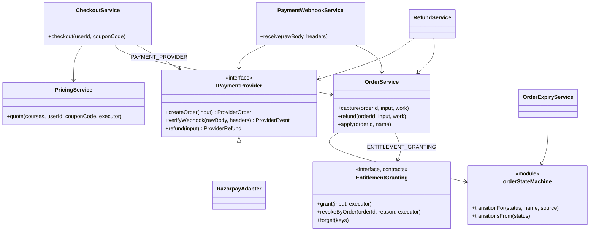
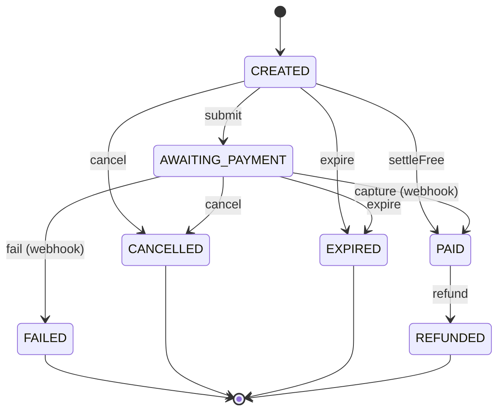
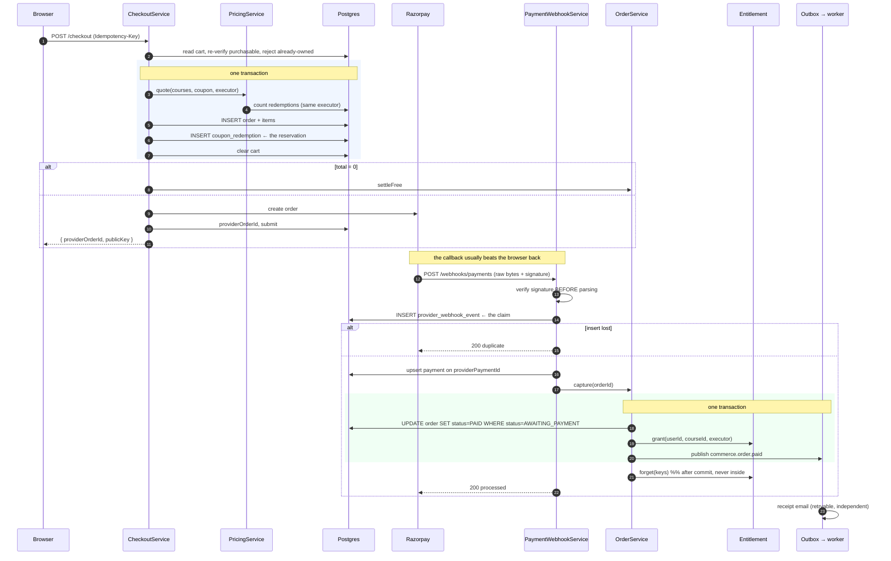

# Commerce & the Order State Machine — Low Level Design

> **One-liner:** turns a cart into money and access, exactly once, across a payment provider
> that guarantees only at-least-once delivery.

**Module:** `apps/api/src/modules/commerce` · **Status:** built
**Last updated:** 2026-09-03

## 1. Problem

A learner fills a cart, applies a coupon, pays a third party we do not control, and must end
up with access — once. Every step can be retried, duplicated, reordered or abandoned, and the
consequences of getting it wrong are a double charge, a free course, or a paying customer who
cannot watch.

## 2. Forces

- **Money.** Every failure mode here is either a chargeback or a support ticket about one.
- **Retries at three layers.** The learner's browser, our own webhook handler, and the
  provider's redelivery — each independently repeats work.
- **At-least-once, from outside.** Razorpay redelivers for up to 24 hours on any non-2xx.
- **Out-of-order arrival.** A refund can overtake its own capture.
- **Webhook before redirect.** The callback usually beats the browser back.
- **Concurrency on a shared resource.** A coupon capped at 100 uses, checked out concurrently.
- **Snapshots.** An instructor repricing a course must not change what an old order charged.
- **We do not control the provider's vocabulary**, and it changes without notice.

## 3. Domain model

`Cart → Order → Payment → Refund`, plus `Coupon`/`CouponRedemption` and
`ProviderWebhookEvent`.

**Invariants**

- **The lifecycle is forward-only.** `PAID` leaves only by refunding. A captured payment is a
  fact in the provider's ledger, and "un-paying" is a refund with different accounting.
- **Prices are snapshotted into `OrderItem`.** Never joined from `Course` — that number is on
  an invoice and possibly in a tax filing.
- **One currency per order.** A mixed cart is refused, never converted.
- **A course appears once** in a cart and once in an order. Quantity is meaningless.
- **`CouponRedemption` is the limit**, not `Coupon.redemptionCount`. The counter is for
  display; a read-then-increment is a check-then-act and a 100-use coupon goes to 140.
- **`CartItem` has no price.** A cart is a list of intentions; pricing is computed on read.

## 4. Class design

### The machine

Only `capture`, `fail` and `refund` are reachable from a webhook. A webhook is an
unauthenticated caller: it may report what the provider did and nothing else.

## 5. Main flow

**The interesting failure — a refund that overtakes its capture.** No edge exists from
`AWAITING_PAYMENT` to `REFUNDED`, so it is a no-op; the provider redelivers it once the order
is `PAID`, and it applies. No buffer, no sequence numbers.

## 6. Patterns used

| Pattern                       | Where                                                              | The force that justified it                                                                                                                                             |
| ----------------------------- | ------------------------------------------------------------------ | ----------------------------------------------------------------------------------------------------------------------------------------------------------------------- |
| **State**                     | `order-state-machine.ts`                                           | Behaviour depends on lifecycle stage, and illegal transitions must be impossible. Kept as an edge list because "what can happen next" is the only question anyone asks. |
| **Adapter**                   | `RazorpayAdapter` → `IPaymentProvider`                             | Their API is shaped for them: forty event types, `receipt` for our order id, a doubly-wrapped webhook body. A second gateway must be a class, not a rewrite.            |
| **Facade**                    | `CheckoutService`                                                  | Checkout is six things in a fixed order, two of which must share a transaction. No caller should know that.                                                             |
| **Observer**                  | `commerce.order.paid` / `.refunded` / `.expired` → worker handlers | One cause, several independently-failing effects.                                                                                                                       |
| **Specification**             | `coupon-rules.ts`                                                  | Seven independent gates on one decision, composable and testable with no clock and no database.                                                                         |
| **Repository + Unit of Work** | `commerce.repository.ts`, `executor` throughout                    | The order, the redemption, the entitlement and the outbox row commit together.                                                                                          |

**Where a pattern was deliberately NOT used.** `PricingService` is not a Strategy over
"pricing engines". There is one pricing rule set, and the variation lives in coupon
_specifications_, which already compose. A `PricingStrategy` interface with one implementation
would be the speculative generality §3 names.

## 7. Alternatives rejected

| Option                                       | Why not                                                                                                               |
| -------------------------------------------- | --------------------------------------------------------------------------------------------------------------------- |
| Grant the entitlement via `order.paid`       | The window between capture and the relay's poll is a learner who paid and cannot watch. ADR-0020.                     |
| A class per order state                      | Seven statuses × six events is 42 methods, 35 of them `throw`.                                                        |
| Price the cart at add-time and store it      | Either honour a stale price or explain at checkout why the number changed.                                            |
| `Coupon.redemptionCount` as the limit        | Read-then-increment is a check-then-act. A 100-use coupon gets 140 redemptions on launch day.                         |
| Dedupe webhooks on `providerPaymentId`       | Several event types share one payment. ADR-0021.                                                                      |
| Check-then-insert the webhook claim          | Two concurrent redeliveries both find nothing and both proceed.                                                       |
| A re-ordering buffer for out-of-order events | No sequence number exists, and the forward-only machine already answers it.                                           |
| Trust the browser redirect                   | The learner can close the tab. The redirect is the unreliable signal.                                                 |
| Revoke access before calling the provider    | Leaves the learner without their money _and_ without the course if the refund is refused.                             |
| The `razorpay` SDK                           | Four calls, two of which are HMAC arithmetic, in exchange for a dependency and its own error shapes and retry policy. |

## 8. Failure modes

**Two rules the table below turns on.** _(1)_ **A claimed webhook is not a processed one.**
The dedupe row is written before dispatch, so a delivery that threw leaves `processedAt`
null; a retry may re-claim such a row, but only when it also carries a `lastError` — that is
what separates "the previous attempt finished and failed" from "another replica is holding it
right now", and the re-claim is a conditional `UPDATE` so fifty simultaneous retries still
produce one winner. Without it, a deadlock inside the capture transaction meant money taken
and no access, with the provider's 200 telling it to stop retrying. _(2)_ **Every un-paid
ending releases the coupon.** Expiry is not the only way an order dies; cancel and decline are
too, and each holds a `CouponRedemption` that enforces `maxRedemptions` and `perUserLimit`.
Only `submit` keeps its hold, because a submitted order is still going to be paid.

| Failure                             | How it is detected                            | Behaviour                                                                | Recovery                                       |
| ----------------------------------- | --------------------------------------------- | ------------------------------------------------------------------------ | ---------------------------------------------- |
| Learner retries checkout            | `Idempotency-Key`                             | First response replayed                                                  | No second order                                |
| Webhook delivered 50×               | Unique `(provider, providerEventId)`          | 1 processed, 49 duplicates                                               | —                                              |
| **Dispatch throws mid-processing**  | Claim row `processedAt IS NULL` + `lastError` | 5xx; the provider's retry **re-claims** it and reprocesses               | Conditional `UPDATE` picks one winner          |
| Redelivery with a _new_ event id    | Conditional `UPDATE ... WHERE status`         | Matches no row; no-op                                                    | Layer two of three                             |
| Redelivery past both                | `Entitlement` unique `(userId, courseId)`     | Upsert                                                                   | Layer three                                    |
| Webhook before redirect             | —                                             | Normal path; nothing waits for the browser                               | —                                              |
| Refund before capture               | No such edge                                  | No-op                                                                    | Provider redelivers after capture              |
| Two checkouts race a 1-use coupon   | Count + insert in one transaction             | One redeems, one refused                                                 | Learner is told which rule refused it          |
| Learner abandons the payment page   | `OrderExpiryService`                          | `EXPIRED`, redemption released                                           | Hourly-scale, safe on N replicas               |
| **Learner cancels / card declined** | `apply(id, 'cancel' \| 'fail')`               | `CANCELLED` / `FAILED`, redemption released in the same transaction      | The coupon is spendable again                  |
| Provider times out on create        | `PaymentProviderException` (502)              | Order stays `CREATED`; sweeper expires it                                | Learner retries                                |
| Provider times out on refund        | Same                                          | Refund not recorded; the stable idempotency key makes a retry one refund | Admin retries                                  |
| Bad webhook signature               | HMAC over raw bytes                           | **400** — terminal for the provider's retry                              | Fix the secret                                 |
| Unknown event type                  | Not in the map                                | Recorded, ignored, 200                                                   | —                                              |
| Event for an unknown order          | No `providerOrderId` match                    | Recorded, `deferred`, 200                                                | Usually a webhook URL from another environment |
| Course unpublished while in a cart  | Re-verified at checkout                       | 400 before any money moves                                               | —                                              |
| `PAID` with no captured payment row | `RefundService` refuses                       | 502 rather than guessing                                                 | Human                                          |

## 9. Data & indexes

| Table                  | Index                                 | Serves                                                                  |
| ---------------------- | ------------------------------------- | ----------------------------------------------------------------------- |
| `Order`                | `providerOrderId` unique              | The webhook's only lookup — and what makes webhook-before-redirect work |
| `Order`                | `(userId, createdAt desc)`            | "My orders"                                                             |
| `Order`                | `(status, expiresAt)`                 | The expiry sweeper's only query                                         |
| `OrderItem`            | `@@unique(orderId, courseId)`         | A course appears once per order                                         |
| `Payment`              | `providerPaymentId` unique            | **Makes capture idempotent** — a redelivered webhook upserts one row    |
| `Refund`               | `providerRefundId` unique             | Same, for refunds                                                       |
| `CouponRedemption`     | `@@unique(couponId, orderId)`         | A coupon applies once per order                                         |
| `CouponRedemption`     | `(couponId, userId)`                  | The per-user cap, counted directly                                      |
| `ProviderWebhookEvent` | `@@unique(provider, providerEventId)` | **The dedupe.** The insert is the claim                                 |

**Transaction boundaries.** Two, both spanning module tables in one database:

1. **Checkout** — quote (counting redemptions), order + items, coupon redemption, cart clear.
   Pricing runs _inside_ with the same executor precisely so the count it reads is the world
   the insert races.
2. **Capture / refund** — the conditional status update, the entitlement grant or revoke, and
   the outbox row.

No provider call happens inside either. Holding a transaction across an HTTP call to Razorpay
would tie a Postgres connection to somebody else's latency.

**Cache invalidation is outside the transaction**, always: `OrderService` collects the keys
it granted and calls `forget()` after the commit (ADR-0018).

## 10. Tests that prove it

**No database, no provider** (53 unit tests)

- **The edge list**: `PAID` leaves only by refunding; no state returns to a pre-payment
  state; every failure state is terminal; a webhook may only `capture`, `fail` and `refund`;
  `capture` is _absent_ from `PAID`, so a redelivery is a no-op rather than an error; the
  free-order shortcut raises the same event a real capture does.
- **Money**: `allocateDiscount` sums **exactly** to the discount across six shapes including
  `[333,333,334]`, never gives a line more than it is worth, and spreads a multi-paise
  remainder rather than dumping it on one line. Percentages round in the learner's favour.
- **Coupons**: all seven rejection reasons, plus the boundaries — valid at the instant it
  starts, dead at the instant it ends, the 100th redemption allowed and the 101st refused.
  A refused coupon never returns a discount.
- **Pricing**: a mixed-currency cart is refused; a bad code still prices the cart and reports
  why; a restricted coupon discounts only its own courses; line discounts sum to the order's.
- **The adapter**: a body whose bytes changed after signing is rejected — the test that fails
  if anyone hands the verifier a parsed object. Also: another secret, no header, no configured
  secret, an unmapped event type ignored rather than thrown, and a **stable** derived event id.

**Real Postgres + real Redis** (25 integration tests)

- **Fifty concurrent deliveries of one webhook → one entitlement, one outbox row, one
  payment row, and exactly one `processed`.** The §11 proof for commerce.
- The webhook works **with no browser call at all** between checkout and callback.
- **A refund arriving before its capture no-ops, and applies on redelivery** — the order ends
  `REFUNDED` and the entitlement `REVOKED`.
- A single-use coupon racing two checkouts redeems **once**; the loser is refused.
- Checkout retried with the same `Idempotency-Key` returns the first order; one order, one
  provider call.
- A free order settles without touching the provider, and grants access in the same
  transaction.
- A refund returns the money **then** revokes access, with a stable `refund:{orderId}`
  idempotency key; refunding an unpaid order is refused before any provider call.
- The sweeper expires an abandoned order and **gives its coupon redemption back**, and never
  touches a paid one.
- The cart reprices when the course's price changes underneath it.

**The three emails** (`apps/worker/.../email-template.spec.ts`)

Commerce raises three events and notification turns each into one email — a receipt, a
refund confirmation, and a recovery nudge for an order nobody paid for. The tests assert the
distinction that matters: the receipt and the refund are `ACCOUNT_SECURITY`, a **mandatory**
category with no unsubscribe footer, because they are records of a payment the learner is
entitled to keep; the recovery email is `PRODUCT_NEWS`, **optional**, because a nudge about a
transaction that never happened is marketing however useful it is, and filing it as a receipt
to escape the preference check would be marketing wearing a receipt's clothes. The recovery
link points at the _order_, not the cart — checkout emptied the cart — and the copy says
outright that the released coupon is no longer being held, so the email cannot imply a price
it will not honour.

## 11. Interview notes — 60-second recall

**Problem.** A cart becomes money and access, across a provider that guarantees only
at-least-once delivery, retries for 24 hours, and can deliver a refund before its capture.

**Shape.** `CheckoutService` (Facade) prices, reserves the coupon and creates the order in one
transaction; the provider is behind an Adapter; the webhook claims, then drives a forward-only
State machine; capture grants the entitlement and writes the outbox row in one transaction.

**The one decision that mattered.** **Idempotency is three independent layers, not one.**
(1) A unique constraint on the provider's event id, where **the insert is the claim** — taken
_before_ processing, so two concurrent redeliveries cannot both proceed. (2) The transition is
a conditional `UPDATE ... WHERE status = 'AWAITING_PAYMENT'`, so even a redelivery with a
fresh event id matches no row. (3) `Entitlement` is unique on `(userId, courseId)`, so the
grant is an upsert. Any one would usually do; the reason for three is that each fails
differently, and this is the path where "usually" is not good enough.

**The second decision.** **The entitlement is granted in the order's transaction, not through
the outbox** — against both the plan and the first reading of §4. "Can fail independently" is
a test, and enrolment fails it: an order that is PAID with no entitlement is a learner who
paid and cannot watch. Both tables are in one database, so there is no distributed transaction
to justify the indirection. The receipt email _does_ go through the outbox, because it can
fail on its own without anything being wrong. ADR-0020.

**The third.** **No re-ordering buffer.** A refund overtaking its capture is answered by the
machine having no such edge — it no-ops, and the provider's own retry applies it once the
order is PAID. Buffering would mean holding an event and deciding when to give up waiting.

**The number.** **Fifty concurrent webhook deliveries → one entitlement, one event, one
payment row.** And a single-use coupon under two racing checkouts → one redemption.

**The seam.** `PAYMENT_PROVIDER` — a `Symbol` and a five-method port. Stripe is a second
adapter and one line in the module. Nothing above the adapter has heard of Razorpay.
