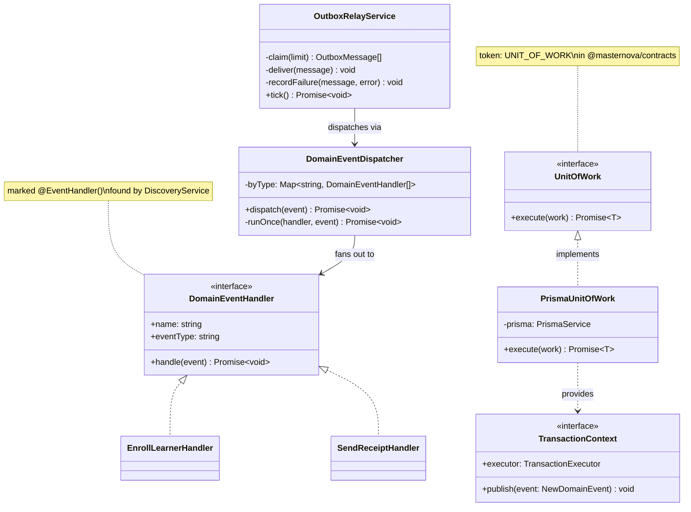
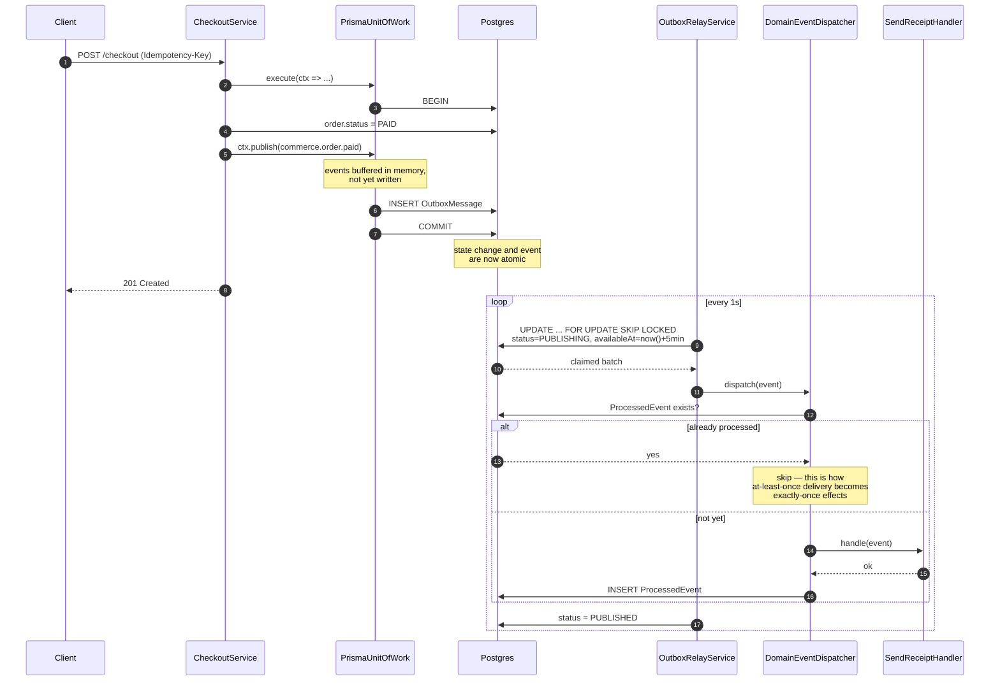
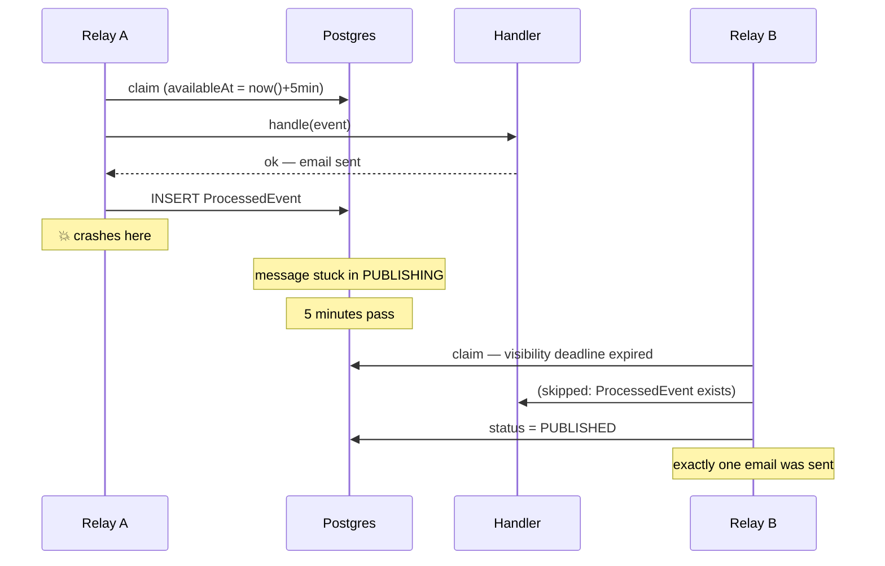

# Platform Kernel — Low Level Design

> **One-liner:** the mechanism every bounded context uses to make a state change and its
> consequences happen exactly once, without any context knowing about another.

**Module:** `apps/api/src/modules/outbox` (write) · `apps/worker/src/modules/outbox-relay` (read)
**Status:** built · **Last updated:** 2026-08-22

## 1. Problem

When an order is paid, four things must happen: the order moves to PAID, the learner is
enrolled, an invoice is raised, a receipt is emailed. The first is a database write we
control. The other three can each fail on their own, take seconds, and involve systems we
do not control.

Doing them inline means a slow SMTP server makes checkout slow, and an SMTP outage makes
checkout fail. Doing them after the commit means a crash in the gap loses them silently —
an order marked PAID with no enrollment, which the customer notices and we do not. Doing
them in a distributed transaction means a two-phase commit across Postgres, a payment
provider and an email API, which is not something any of those three offer.

This module is the answer to that, built once so no context has to solve it again.

## 2. Forces

- **Partial failure.** Any consequence can fail independently of the others and of the cause.
- **Retries.** Every consumer will be retried, so every effect must tolerate being attempted twice.
- **Concurrency.** Multiple relay replicas poll one table; multiple clients retry one request.
- **Crash at any point.** Including between "handler succeeded" and "message marked published".
- **Money.** A duplicated enrollment is embarrassing. A duplicated charge is a chargeback.
- **No distributed transaction is available.** Postgres, Razorpay and an email provider do
  not share a transaction manager, and never will.

## 3. Domain model

This module owns no domain. It owns three tables that domains use.

| Table               | Invariant                                                                                                                 |
| ------------------- | ------------------------------------------------------------------------------------------------------------------------- |
| `OutboxMessage`     | A row exists **if and only if** the state change that caused it committed. `eventId` is unique and stable across retries. |
| `ProcessedEvent`    | `(eventId, handler)` is written only **after** that handler succeeded. Its presence means "this effect has happened".     |
| `IdempotencyRecord` | `(scope, key)` is unique. A key belongs to exactly one caller and one request body.                                       |

**Legal states of an outbox message:**

```
PENDING ──claim──> PUBLISHING ──success──> PUBLISHED   (terminal)
   ^                    │
   └──── failure ───────┤   (backoff: availableAt moved forward)
                        │
                        └──attempts exhausted──> DEAD  (terminal, retained for replay)
```

A crashed relay leaves a message in `PUBLISHING`. It returns to the claimable set when its
visibility deadline passes — there is no separate reaper.

## 4. Class design



The seam: contexts inject `UNIT_OF_WORK` and never see `PrismaUnitOfWork`. Handlers are marked
`@EventHandler()` and collected at bootstrap through Nest's `DiscoveryService`, so `commerce`
never imports `notification` to send a receipt — and the dispatcher never learns which
contexts exist.

> **Changed in task 1.3.** This was a `DOMAIN_EVENT_HANDLER` multi-provider token. Two
> problems surfaced the moment a real consumer existed: Nest's `multi` providers do not
> merge across modules, so the second context to register handlers would have silently
> shadowed the first, and making injection work at all required `outbox-relay` to import
> the consuming module — the cross-context import `CLAUDE.md` §4 forbids. Discovery costs
> fifteen lines in the dispatcher and makes adding a consumer a zero-edit change to the
> kernel (§1 O). The token is gone; the interface in `@masternova/contracts` is unchanged.

## 5. Main flow



**The interesting failure path** — the relay crashes between `handle()` succeeding and
`status = PUBLISHED`:



## 6. Patterns used

| Pattern                   | Where                                                      | The force that justified it                                                                                                                        |
| ------------------------- | ---------------------------------------------------------- | -------------------------------------------------------------------------------------------------------------------------------------------------- |
| **Observer / pub-sub**    | `DomainEventDispatcher` fanning one event to many handlers | One cause, many effects that fail independently. Direct calls would couple `commerce` to `notification` and make an SMTP outage a checkout outage. |
| **Unit of Work**          | `PrismaUnitOfWork`                                         | The state change and its events must commit together. Making the transaction the only way to publish removes the chance to forget.                 |
| **Repository**            | Handlers receive `ctx.executor`, never a global client     | Services are tested with a fake; the ORM stays behind the boundary.                                                                                |
| **Decorator** _(planned)_ | Retry/log wrappers around handlers                         | Not built. One handler is not a seam (`CLAUDE.md` §3).                                                                                             |

## 7. Alternatives rejected

| Option                                           | Why not                                                                                                                                                               |
| ------------------------------------------------ | --------------------------------------------------------------------------------------------------------------------------------------------------------------------- |
| Publish to a queue directly after commit         | The gap between commit and publish is unbounded. A crash there loses the effect with no trace, and it is the single most common way "reliable" systems lose messages. |
| Two-phase commit across Postgres and the broker  | Neither Razorpay nor an email API is an XA participant. Even where it is possible, an in-doubt transaction blocks the database.                                       |
| Listen to the WAL with Debezium/CDC              | Better at 10x, and it is written up as the migration path (`PROJECT_PLAN.md` §10). Today it means running Kafka Connect to avoid one polling loop.                    |
| `NOTIFY`/`LISTEN` instead of polling             | Not durable — a notification delivered while no relay is connected is gone, so a poll is still needed as the floor. Adds a mechanism without removing one.            |
| Mark `ProcessedEvent` before running the handler | Turns at-least-once into at-most-once: a handler that throws is never retried, and the effect is lost silently.                                                       |
| Delete dead letters                              | Destroys the payload needed to replay after the bug is fixed.                                                                                                         |

## 8. Failure modes

| Failure                        | Detected by                      | Behaviour                                                                   | Recovery                                                         |
| ------------------------------ | -------------------------------- | --------------------------------------------------------------------------- | ---------------------------------------------------------------- |
| Handler throws                 | Dispatcher catches, aggregates   | Message → `PENDING`, `availableAt` pushed out exponentially (2s → 5min cap) | Automatic retry                                                  |
| Handler keeps failing          | `attempts >= 8`                  | Message → `DEAD`, payload retained, error logged                            | Manual replay endpoint (task 1.9)                                |
| Relay crashes mid-delivery     | Visibility deadline expires      | Another relay reclaims after 5 min                                          | Handler skipped if `ProcessedEvent` exists — no duplicate effect |
| Two relays poll simultaneously | —                                | `FOR UPDATE SKIP LOCKED` gives each a disjoint set                          | No coordination needed; proven by test                           |
| Relay falls behind             | Queue depth metric (task 2.10)   | Messages accumulate; nothing is lost                                        | Scale the worker fleet — the same signal that autoscales it      |
| One handler slow/broken        | Per-handler `ProcessedEvent`     | Others still complete and are not re-run                                    | Only the failing handler retries                                 |
| Client retries a charge        | `(scope, key)` unique constraint | Stored response replayed, or 409 while in flight                            | No second charge                                                 |
| Same key, different body       | `requestHash` mismatch           | 422 — rejected rather than guessed at                                       | Client bug, surfaced not hidden                                  |

## 9. Data & indexes

| Index                                           | Serves                                                  |
| ----------------------------------------------- | ------------------------------------------------------- |
| `OutboxMessage(status, availableAt, createdAt)` | The relay claim query — the only hot read on this table |
| `OutboxMessage.eventId` unique                  | Consumer dedupe key                                     |
| `OutboxMessage(aggregateType, aggregateId)`     | "What happened to this order?" during support           |
| `ProcessedEvent(eventId, handler)` PK           | The dedupe lookup on every delivery                     |
| `IdempotencyRecord(scope, key)` unique          | The claim; doubles as the lock                          |
| `IdempotencyRecord(expiresAt)`                  | The sweeper (not yet built — see below)                 |

**Transaction boundaries.** One: `PrismaUnitOfWork.execute`. State changes and outbox rows
commit together. The relay deliberately does _not_ wrap dispatch in a transaction — holding
one open across a network call to an email provider is how connection pools die.

**Known gap:** nothing sweeps expired `IdempotencyRecord` rows yet. The index exists; the
job lands with commerce in task 1.9, when there is real traffic to sweep.

## 10. Tests that prove it

**Unit** (`domain-event-dispatcher.spec.ts`, no database — 8 tests): fan-out by type;
unrelated types untouched; no-handler is success not error; **same event delivered 3× runs
the handler once**; per-handler dedupe so a newly-added handler still sees old events;
one handler throwing does not stop others; **a retry re-runs only the handler that failed**;
a throwing handler is not marked processed.

**Integration, real Postgres** (`unit-of-work.int-spec.ts` — 4 tests): state and events
commit together; **a rollback discards the events** — the failure the pattern exists to
prevent; 25 events get 25 distinct ids; no events means no rows.

**Integration, real Postgres** (`outbox-relay.int-spec.ts` — 7 tests): delivery marks
published;not-yet-due messages are left alone; **10 relays × 40 messages → exactly 40 deliveries**
(the `SKIP LOCKED` proof); failure backs off and stays retryable; exhausted attempts
dead-letter with the payload retained and the real cause recorded; **10 relay ticks → 1
effect**; a message stranded in `PUBLISHING` is recovered.

**Integration, real Postgres** (`idempotency.int-spec.ts` — 7 tests): key required when
marked; unmarked endpoints unaffected; retry replays the stored response;
**50 concurrent requests with one key → exactly 1 execution**; same key + different body →
422; keys are scoped per caller; a failed handler releases the key so a genuine retry works.

## 11. Interview notes — 60-second recall

**The problem.** An order being paid must enroll the learner, invoice them and email a
receipt. Those fail independently and involve systems I do not control, so they cannot be
in the payment transaction — but doing them after it means a crash loses them silently.

**The decision that mattered.** A transactional outbox. The order state change and a row
per consequence commit in **one Postgres transaction**, so the event exists exactly when the
thing it describes did. A relay in the worker then publishes them. That buys exactly-once
_effects_ with no distributed transaction.

**The two details people miss.** First, at-least-once delivery only becomes exactly-once
_effects_ if consumers dedupe — a `(eventId, handler)` row written **after** the handler
succeeds, never before, because marking first turns a crash into a lost effect. Second,
claiming with `FOR UPDATE SKIP LOCKED` **and** pushing `availableAt` forward, so N relays
scale linearly and a relay that dies mid-delivery releases its message automatically.
`SKIP LOCKED` alone is not enough: it only holds for the claiming transaction, so a second
relay polling a moment later re-claims the row.

**The number.** 10 concurrent relays over 40 messages produce exactly 40 deliveries; 50
concurrent requests with one idempotency key produce exactly 1 charge. Both are tests, not
estimates — and the second one caught a real double-delivery bug in my first implementation.
