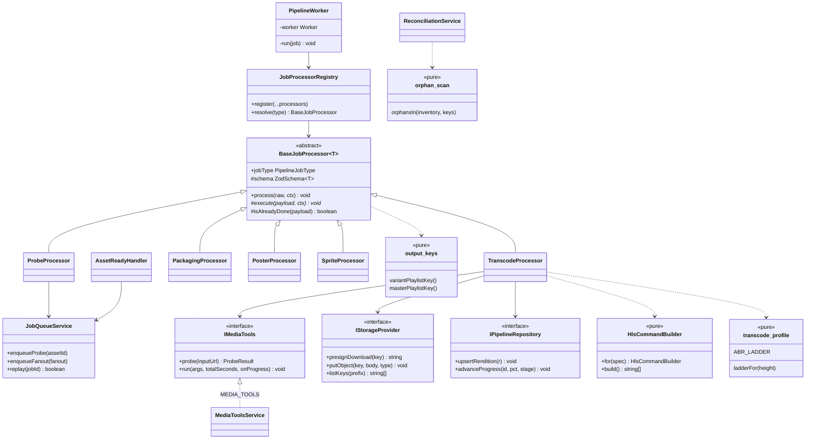
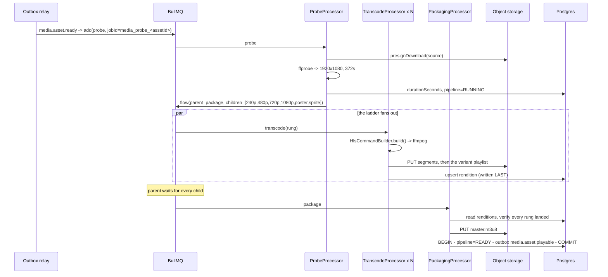

# Video pipeline — Low Level Design

> **One-liner:** turns one uploaded source into an adaptive-bitrate HLS ladder, a poster and
> a scrub filmstrip, without ever losing or duplicating work when a worker dies.

**Module:** `apps/worker/src/modules/pipeline` · **Status:** built
**Last updated:** 2026-09-02

## 1. Problem

Task 1.6 puts a source file in object storage and raises `media.asset.ready`. That file is
not watchable: it may be 4K, it may be 10 GB, and serving it directly means a learner on a
train downloads the whole thing to watch the first minute. Something has to turn it into
something a player can adapt to — and do so on a fleet of workers that are evicted, scaled
down and redeployed mid-job.

## 2. Forces

| Force                                    | Where it bites                                                                                                                                    |
| ---------------------------------------- | ------------------------------------------------------------------------------------------------------------------------------------------------- |
| **CPU-bound work, minutes long**         | A rung of a 90-minute lecture takes minutes. Anything holding a lock, a connection or a transaction for that duration is a design error.          |
| **At-least-once delivery**               | BullMQ redelivers. A worker SIGKILLed mid-encode _will_ see its job again, and must not produce a second rendition or a second event.             |
| **The DAG's shape is not known upfront** | The ladder depends on the source resolution, which nothing knows until ffprobe has run.                                                           |
| **Fan-out with a join**                  | The master playlist can only be written once every rung exists. Two rungs finishing in the same millisecond must not double-fire or lose a count. |
| **An external process**                  | ffmpeg fails by exit code, is killed by the OOM killer, and reports progress on a pipe. It is not a library and cannot be mocked into behaving.   |
| **Invisible cost**                       | Objects nothing references are billed forever and do not show up anywhere but the bill.                                                           |
| **A human is watching**                  | An instructor sits on the wizard waiting. A bar that stalls or goes backwards reads as a broken upload.                                           |

## 3. Domain model

**`Asset.pipeline`** is a second axis from `Asset.status`, deliberately: `status = READY`
means the bytes arrived, `pipeline = READY` means they are playable. Collapsing them would
make "upload finished" and "transcode finished" the same fact, and the publish gate needs
to tell them apart.

**`MediaRendition`** is one row per output — a ladder rung, the master, the poster, the
sprite. `@@unique([assetId, name])` is not documentation: it is the idempotency mechanism.
A redelivered job writes the same deterministic key and upserts the same row.

**Invariants**

- A rendition row exists **only after every byte of that output is in the bucket**. The row
  is the completion marker, so it is written last.
- Exactly one `media.asset.playable` per asset, in the same transaction as `pipeline = READY`.
- Progress never decreases.
- The source object is never deleted by anything in this module.

## 4. Class design

## 5. Main flow

**The failure path that shaped the design.** A worker is SIGKILLed at 80% of the 720p rung.
BullMQ's lock expires and the job is redelivered. `isAlreadyDone` finds no rendition row —
because the row is written last — so it re-encodes from scratch. The segments it had already
written are **overwritten by the same deterministic keys** rather than duplicated, and the
run that finishes writes the row. Zero duplicate renditions, zero orphans, no coordination
between the two runs.

## 6. Patterns used

| Pattern             | Where                                              | The force that justified it                                                                                                                                                                                                           |
| ------------------- | -------------------------------------------------- | ------------------------------------------------------------------------------------------------------------------------------------------------------------------------------------------------------------------------------------- |
| **Template Method** | `BaseJobProcessor`                                 | Five processors share four obligations that are easy to get individually right and collectively inconsistent — validate, skip-if-done, execute, fail explainably. The fourth processor is the one that forgets the idempotency check. |
| **Factory Method**  | `JobProcessorRegistry` + `@JobProcessor`           | One queue carries five job types, so something must turn a discriminator into a handler. A `switch` in the worker means adding 1.16's transcription stage edits the file every existing stage depends on (§1 O).                      |
| **Strategy**        | `ABR_LADDER` / `transcode-profile.ts`              | "Transcode the video" is four algorithms differing in resolution, bitrate and buffer. As data, a new rung is an entry; as a `switch`, it is an edit.                                                                                  |
| **Builder**         | `HlsCommandBuilder`                                | Twenty-odd ffmpeg flags whose **validity depends on each other** — the GOP must divide `hls_time × fps`, `-maxrate` is inert without `-bufsize`. Stepwise assembly with a validity condition is what a Builder is for.                |
| **Adapter**         | `IMediaTools` ← `MediaToolsService`                | ffmpeg is a pair of command-line tools, not a library. Behind a port, every processor is testable without a 200 MB binary.                                                                                                            |
| **Observer**        | `media.asset.ready` in, `media.asset.playable` out | The pipeline is a consumer `media` never heard of, and a producer `catalog` and `notification` will consume without this module learning they exist.                                                                                  |

**Why Template Method here and nowhere else.** CLAUDE.md §3 allows inheritance only for a
genuine `is-a` with a stable contract. Every pipeline job _is_ one in exactly this sense:
the four steps are not optional and their order is not negotiable. It was deliberately
deferred from task 1.1, where it would have had zero subclasses.

## 7. Alternatives rejected

| Option                                            | Why not                                                                                                                                                                                                                                 |
| ------------------------------------------------- | --------------------------------------------------------------------------------------------------------------------------------------------------------------------------------------------------------------------------------------- |
| **Progressive MP4 / DASH / a managed service**    | [ADR-0003](../adr/0003-hls-over-progressive-mp4.md).                                                                                                                                                                                    |
| **Build the whole DAG upfront**                   | The ladder depends on the source resolution, which nothing knows before ffprobe. Guessing would mean cancelling the rungs that turned out to be upscales.                                                                               |
| **Count child completions ourselves**             | Needs a counter and an owner for it. Two rungs finishing simultaneously either double-fire the packager or lose the increment. A BullMQ flow makes "parent waits for children" the queue's atomic primitive, which is where it belongs. |
| **One queue per job type**                        | Gives each stage its own concurrency knob, and splits queue depth — the number 2.6's autoscaler reads — five ways, over one autoscaled pool sized on total CPU.                                                                         |
| **A `dead_letter_jobs` table**                    | BullMQ's failed set already holds the payload, attempt count and every attempt's stack. A table beside it is a dual write against state Redis owns, free to disagree. Same argument as ADR-0017.                                        |
| **Encode the whole ladder in one ffmpeg process** | ffmpeg can emit every rung in one pass, which is cheaper in decode. It also makes one failed rung re-encode all four, makes the unit of retry the whole ladder, and gives the autoscaler one long job instead of four schedulable ones. |
| **Stage the source to local disk first**          | ffmpeg speaks HTTP, so a presigned URL is streamed and decoded as it arrives. Staging would need 10 GB of scratch per concurrent job and a cleanup path for every failure mode.                                                         |
| **Subscribe to BullMQ `QueueEvents` for SSE**     | It reports _per-job_ progress; the wizard wants one number across a five-job DAG. Reassembling it in the API would put the DAG's shape in two places. The worker already collapses it into one ratcheted column.                        |
| **Walk the bucket to find orphans**               | `ListObjectsV2` over a million-object bucket to find a handful of strays. The sweep is driven from the database instead — one indexed query for the assets that could have them.                                                        |

## 8. Failure modes

| Failure                                 | How it is detected                        | Behaviour                                                                 | Recovery                                                      |
| --------------------------------------- | ----------------------------------------- | ------------------------------------------------------------------------- | ------------------------------------------------------------- |
| Worker killed mid-encode                | BullMQ lock expires (30 min)              | Job redelivered                                                           | Re-encodes; deterministic keys overwrite, no duplicate row    |
| Duplicate `media.asset.ready`           | Deterministic `jobId`                     | BullMQ refuses the second add                                             | No-op                                                         |
| Malformed payload                       | Zod parse in the template                 | `UnrecoverableJobError` → straight to the DLQ                             | Operator inspects; no wasted backoff                          |
| Source with no video stream             | ffprobe finds no decodable stream         | Unrecoverable                                                             | Instructor re-uploads                                         |
| Rung no longer in the ladder            | `profileFor` returns undefined            | Unrecoverable                                                             | Re-run the asset against the new ladder                       |
| ffmpeg OOM-killed                       | Exit code `null` + signal                 | Logged as `killed by SIGKILL`, retried                                    | Larger task size; the signal is what distinguishes it         |
| Transient S3 5xx                        | Exception                                 | 5 attempts, exponential from 10s (~2.5 min to DLQ)                        | Usually self-heals                                            |
| A rung missing at package time          | Explicit check before writing the master  | Retries                                                                   | A master never lists a playlist that is not there             |
| Rungs report progress out of order      | `updateMany ... WHERE percent < ?`        | The lower write matches nothing                                           | Bar never goes backwards                                      |
| Ladder changed, old rungs left          | Reconciliation sweep                      | Orphaned objects deleted hourly                                           | —                                                             |
| Unknown job type (deploy skew)          | Registry returns undefined                | **Retryable** — the next pod may have it                                  | Dead-letters if genuinely unknown                             |
| Every attempt exhausted                 | Last attempt, or `UnrecoverableJobError`  | `pipeline = FAILED` + `media.asset.processing_failed`, in one transaction | Operator replays from the DLQ                                 |
| Redis restarts under the worker         | BullMQ `'error'` on queue/worker/flow     | Logged; ioredis reconnects                                                | None needed — but with no listener it would crash the process |
| SSE client vanishes                     | `request.raw.on('close')` → `AbortSignal` | The generator's poll is cut mid-sleep and returns                         | —                                                             |
| Progress never reaches a terminal state | 30-minute stream deadline                 | The stream closes itself; SSE reconnects if the client still cares        | —                                                             |

## 9. Data & indexes

| Table            | Index                     | Serves                                                        |
| ---------------- | ------------------------- | ------------------------------------------------------------- |
| `MediaRendition` | `@@unique(assetId, name)` | **The idempotency key** — upsert target for every re-run      |
| `MediaRendition` | `@@unique(storageKey)`    | A key is identity; a collision is a bug, not a retry          |
| `MediaRendition` | `(assetId, kind)`         | "Every rung for this asset", read by packaging and the player |
| `Asset`          | `(status)`                | Also serves the reconciliation sweep's candidate query        |

**Transaction boundaries.** Two, and both are the same shape: a terminal state change plus
its outbox event. Packaging commits `pipeline = READY`, the master rendition row and
`media.asset.playable` together; `PipelineFailureService` commits `pipeline = FAILED` and
`media.asset.processing_failed` together. Every repository call inside them takes
`ctx.executor` — a call that omits the handle runs on the base client and auto-commits on
its own connection, which quietly reintroduces the window the transaction exists to close.

Everything else — every ffmpeg run, every S3 write — happens **outside** a transaction.
Holding a Postgres connection across a multi-minute encode would exhaust the pool with two
concurrent jobs.

**The sweep pages with a keyset cursor** (ADR-0015), ordered by `id`. Ordering by
`updatedAt` and taking the first 100 looked right and never advanced: deleting an S3 object
does not touch the row, so every hourly pass re-examined the same oldest batch and asset 101
onwards was never reconciled — invisibly, because a sweep that finds nothing reports zero
deletions exactly like a sweep that has already cleaned its batch.

## 10. Tests that prove it

**No ffmpeg, no Redis, no database** (117 unit tests)

- The parts of the argv that must agree: **the GOP divides `hls_time × fps`**, `keyint_min`
  equals `-g`, scene detection is off, `-maxrate` always has a `-bufsize`, codec flags come
  after `-i`. All asserted against the built argv array.
- The ladder **never upscales**, always yields at least one rung, and every derived width is
  even — asserted across seven source aspect ratios, because H.264's 4:2:0 chroma cannot
  represent an odd dimension and ffmpeg fails outright.
- The template **rejects a malformed payload as unrecoverable without executing**, skips
  when the processor says the work is done, and defaults to redoing it otherwise.
- The registry refuses two processors claiming one type.
- Job ids contain no character BullMQ rejects.
- `orphansIn` keeps the source, keeps everything while a pipeline is running, and orphans
  only a rung directory with no rendition.
- Progress weights tile 0–100 exactly and never leave the range.
- The poster offset **never seeks past the end** of a short source — the clamp was inverted,
  and a one-second upload seeked to exactly its duration, wrote no file, and burned five
  attempts on an ENOENT.
- ffmpeg's `-progress` stream is **reassembled across chunk boundaries**: a fake ffmpeg
  splits `out_time_us=6000000` mid-number, and then writes one byte at a time, and the
  reported fractions stay monotonic. The naive `chunk.split('\n')` reported 60µs of a
  12-second encode.
- `PipelineFailureService` writes `FAILED` **and publishes in the same transaction**,
  truncates a runaway reason, and never throws over a failure it could not record — the
  caller is in a catch block holding the error that actually matters.

**Real ffmpeg + real MinIO + real Redis + real Postgres** (11 integration tests)

- **Encodes a rung and every segment lands in the bucket** — then fetches the variant
  playlist and asserts every `.ts` it names actually exists.
- **Run it twice → identical object set, one rendition row.** The idempotency claim, run.
- **Master playlist is well-formed**, lists the rung, carries `BANDWIDTH` and `RESOLUTION`,
  and the asset reaches `pipeline = READY` at 100%.
- **Exactly one `media.asset.playable`** in the outbox.
- Packaging **refuses while a rung is missing**.
- Poster and sprite are real JPEGs (magic bytes), and the sprite VTT indexes them.
- Progress **does not move backwards** when a slow rung reports after a fast one.

## 11. Interview notes — 60-second recall

**Problem.** One uploaded lecture → an adaptive HLS ladder, on workers that get killed
mid-job.

**Shape.** `media.asset.ready` → probe → **fan out one job per rung** → BullMQ flow joins
them → write the master → `media.asset.playable`. The ladder is decided by probe because
nothing knows the source resolution before it, and it is **capped at the source** so a 480p
upload never gets a 1080p rung.

**The one decision that mattered.** **Idempotency is a naming scheme, not a lock.** Every
output key is a pure function of the asset id and the rendition name, and the rendition row
is written _last_ — so a worker SIGKILLed at 80% is redelivered, re-encodes, overwrites its
own partial output, and produces exactly one row. No coordination, no distributed lock, no
compensating transaction.

**The number.** SIGKILL mid-transcode → **one rendition row, one set of objects, one event**.
And ten concurrent completes on the upload side (task 1.6) → one 200, nine 409.

**The patterns, with their forces.** Template Method because five processors share four
obligations and the fourth one forgets the idempotency check. Factory Method so 1.16's
transcription stage is a new class, not an edit. Builder because the ffmpeg flags are
_interdependent_ — get the GOP wrong and segment boundaries drift, rungs stop agreeing where
segments start, and switching rungs stutters. Strategy for the ladder because it is data.

**The seam.** `IMediaTools` — ffmpeg behind a port, so every processor is unit-tested
without it, and 1.16's Whisper is a second tool behind the same runner.
