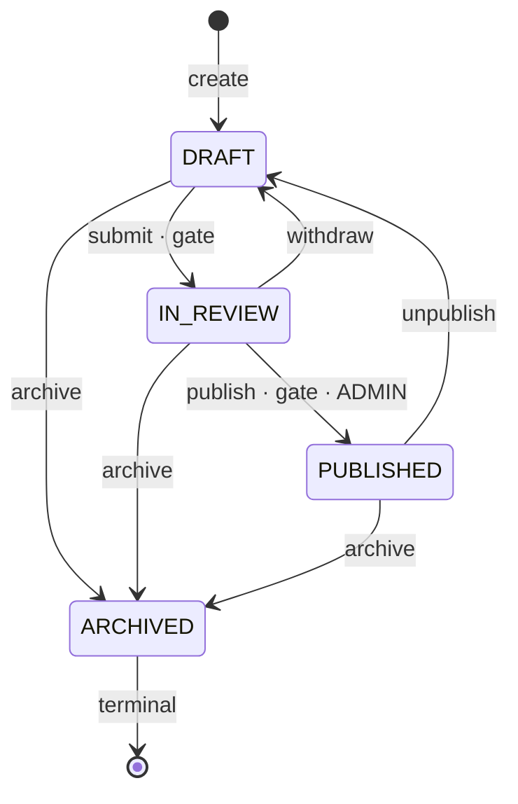
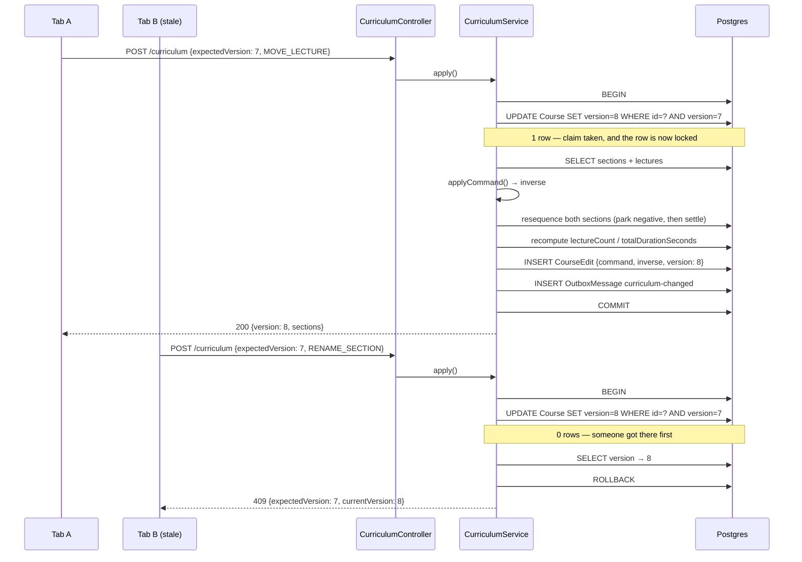
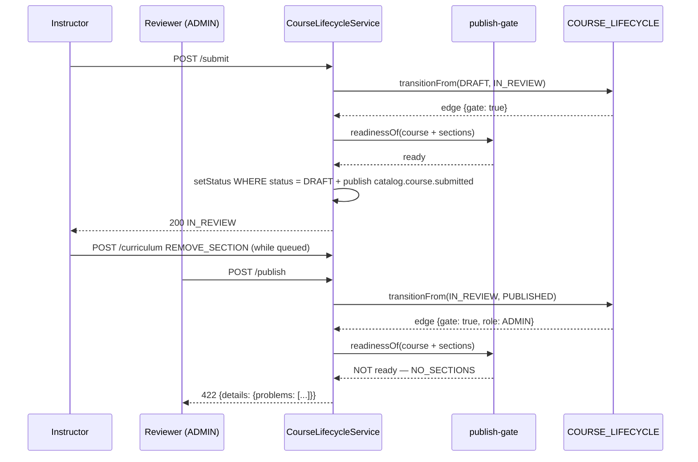

# Course authoring — the wizard, the draft state machine and the publish gate

> **One-liner:** how an instructor builds a course over days and two open tabs without
> losing an edit, and how a half-finished one is stopped from reaching the catalog.

**Module:** `apps/api/src/modules/catalog/{lifecycle,curriculum}` · **Status:** built
**Last updated:** 2026-08-23

## 1. Problem

Authoring a course is not a form submit. It is a session that spans days: an instructor
types a description on Monday, uploads six videos on Wednesday, drags a lecture into a
different section on Friday, and presses publish the week after. In between they leave a tab
open on a laptop, open another on a desktop, mis-drag a section into the bin, and expect
Ctrl-Z to work.

Every one of those is a distinct engineering problem, and three of them are the ones that
bite: a concurrent save silently discarding the other tab's work, a course reaching the
public catalog with three empty sections and no price, and a reorder that violates the
database's position constraint halfway through.

## 2. Forces

- **Two open tabs is a real bug, not a hypothetical.** Autosave means the losing tab
  overwrites with stale content, and nobody notices until the description reverts.
- **The publish gate must be a server rule.** Client-side wizard validation is a
  convenience; the transition is the only place it can be enforced.
- **Illegal transitions must be impossible**, not merely discouraged — PUBLISHED is what the
  public query matches and ARCHIVED is what stops sales.
- **Undo has to survive a load balancer.** The API is more than one ECS task; the tab that
  made an edit is not guaranteed to reach the same process when it presses undo.
- **Ordering is constrained by the database.** `@@unique([courseId, position])` is checked
  per statement, so a swap fails halfway even though the finished layout is legal.
- **Denormalised counters.** `lectureCount` and `totalDurationSeconds` are on the course row
  and read by every catalog card; every curriculum edit has to keep them true.
- **The review step must be real.** An `IN_REVIEW` nobody has to pass through is a lie in an
  enum.

## 3. Domain model

The aggregate is unchanged from `catalog.md` — `Course` is the root, `Section` and `Lecture`
live inside it. This module adds two things to it.

| Field / table       | Meaning                                                                                                               |
| ------------------- | --------------------------------------------------------------------------------------------------------------------- |
| `Course.version`    | Optimistic-concurrency token. Bumped by **every content write**, claimed conditionally.                               |
| `Course.priceSetAt` | Stamped the first time pricing is confirmed. Disambiguates "free" from "nobody has priced this yet".                  |
| `CourseEdit`        | One applied curriculum command, its inverse, the version it produced, and whether it has been undone. The undo stack. |

**Legal states, and who may move between them:**

Invariants:

- **No path from DRAFT straight to PUBLISHED.** If one existed, `IN_REVIEW` would be
  decorative. A unit test asserts its absence.
- **The gate runs on both edges into and out of review**, because the course can be edited
  while it queues — approving what a reviewer saw is not the same as publishing what it
  became.
- **ARCHIVED is terminal.** An archived course may have been taken down over a rights
  complaint; a one-click restore puts it back on sale with no second look. Bringing one back
  means duplicating it (the Prototype) into a fresh DRAFT, which is reviewed like anything
  else.
- **An archived course rejects every content write**, not only transitions — archiving is
  the delete this domain has.

## 4. Class design

```mermaid
classDiagram
  class CourseLifecycleService {
    +readiness(courseId, actor) PublishReadiness
    +transition(courseId, to, actor) Course
  }
  class CurriculumService {
    +get(courseId, actor) Curriculum
    +apply(courseId, request, actor) Curriculum
    +undo(courseId, actor) Curriculum
  }
  class CourseAccessService {
    +assertOwned(courseId, actor) Course
    +assertEditable(courseId, actor) Course
  }

  class COURSE_LIFECYCLE["COURSE_LIFECYCLE (pure)"] {
    <<state map>>
    +allowedFrom(status) CourseStatus[]
    +transitionFrom(from, to) CourseTransition?
  }
  class PublishGate["publish-gate (pure)"] {
    +PUBLISH_REQUIREMENTS PublishRequirement[]
    +readinessOf(snapshot) Readiness
  }
  class Commands["curriculum-commands (pure)"] {
    +applyCommand(cmd, before, ctx) CurriculumInverse
  }

  class ICourseWriter {
    <<interface>>
    +claimVersion(id, expected, tx) VersionClaim
    +bumpVersion(id, tx) number
    +setStatus(id, status, tx) Course
  }
  class ICurriculumReader {
    <<interface>>
    +load(courseId, tx) CurriculumAggregate
  }
  class ICurriculumWriter {
    <<interface>>
    +createSection/renameSection/deleteSection()
    +createLecture/updateLecture/deleteLecture()
    +resequenceSections(placements, tx)
    +resequenceLectures(placements, tx)
    +refreshRollups(courseId, tx)
  }
  class ICourseEditLog {
    <<interface>>
    +record(edit, tx)
    +peek(courseId, tx) CourseEditEntry?
    +markUndone(id, tx)
    +hasUndoable(courseId, tx) boolean
  }

  class PrismaCourseRepository
  class PrismaCurriculumRepository
  class PrismaCourseEditLog

  CourseLifecycleService --> COURSE_LIFECYCLE
  CourseLifecycleService --> PublishGate
  CourseLifecycleService --> CourseAccessService
  CourseLifecycleService --> ICourseWriter
  CourseLifecycleService --> ICurriculumReader
  CurriculumService --> Commands
  CurriculumService --> CourseAccessService
  CurriculumService --> ICourseWriter
  CurriculumService --> ICurriculumReader
  CurriculumService --> ICurriculumWriter
  CurriculumService --> ICourseEditLog
  ICourseWriter <|.. PrismaCourseRepository
  ICurriculumReader <|.. PrismaCurriculumRepository
  ICurriculumWriter <|.. PrismaCurriculumRepository
  ICourseEditLog <|.. PrismaCourseEditLog
```

Injection tokens: `COURSE_READER`, `COURSE_WRITER` (`useExisting` onto one
`PrismaCourseRepository`), `CURRICULUM_READER`, `CURRICULUM_WRITER` (likewise onto one
`PrismaCurriculumRepository`), `COURSE_EDIT_LOG`, `UNIT_OF_WORK`.

The three pure modules are the whole design. Everything interesting — which transitions
exist, what makes a course publishable, what the inverse of an edit is — lives in a file
with no Nest, no Prisma and no request in it, which is why 39 of this module's tests need no
database.

## 5. Main flow

The happy path is one curriculum edit; the interesting failure is the second tab.

The claim is the **first** statement on purpose. It does two jobs in one round trip: it
validates the optimistic-concurrency token, and it takes the course row's lock, so two
requests that arrive together cannot interleave their curriculum writes. A read-then-compare
would have neither property.

Publishing:

## 6. Patterns used

| Pattern           | Where                                                                     | The force that justified it                                                                                                                  |
| ----------------- | ------------------------------------------------------------------------- | -------------------------------------------------------------------------------------------------------------------------------------------- |
| **State**         | `COURSE_LIFECYCLE` — each status owns its outgoing edges and their guards | Illegal transitions must be impossible; the edge list is the interesting content and callers must not be able to express a transition off it |
| **Command**       | `curriculumCommandSchema` + `HANDLERS` — every wizard edit is a value     | **Undo.** A reversal needs the edit to be a storable object; nine REST verbs cannot be inverted                                              |
| **Repository**    | `ICurriculumReader/Writer`, `ICourseEditLog`, aggregate-scoped            | Services testable with a fake; the aggregate's rollups kept honest in one place                                                              |
| **Unit of Work**  | claim → apply → rollups → log → outbox, one transaction                   | A half-applied drag, or an edit recorded without its inverse, must not be a reachable state                                                  |
| **Specification** | reused unchanged from 1.4 for visibility                                  | —                                                                                                                                            |

**Deliberately not used.**

- **Builder** was listed for this task and dropped. The publish gate is a list of independent
  named requirements, not a stepwise construction with a validity check at the end; wrapping
  it in a builder would add ceremony and remove the property that makes it useful — that the
  same list produces both the 422 and the wizard's per-step checklist. The real Builder in
  this codebase is the ffmpeg HLS command (task 1.7).
- **A class per state with a method per event.** Four states × five events is twenty methods,
  seventeen of which are `throw`. See `course-lifecycle.ts` for the argument.

## 7. Alternatives rejected

| Option                                                        | Why not                                                                                                                                                                          |
| ------------------------------------------------------------- | -------------------------------------------------------------------------------------------------------------------------------------------------------------------------------- |
| Last-write-wins autosave                                      | The losing tab's work vanishes with no error. The whole reason `version` exists.                                                                                                 |
| `updatedAt` as the concurrency token                          | Two writes inside one clock tick tie, and Postgres's `now()` is transaction-start time — two autosaves a millisecond apart genuinely can share it. A counter cannot tie.         |
| Pessimistic locking (`SELECT FOR UPDATE` held across the tab) | A lock held for the length of a human editing session is a lock held until the browser crashes.                                                                                  |
| An in-memory undo stack                                       | Works on a laptop; loses the history the moment there are two API tasks or one deploy. `CourseEdit` is a table for that reason.                                                  |
| Deriving the inverse at undo time                             | Impossible. The inverse of a removal is the content that was removed, and it exists only before the delete runs.                                                                 |
| Nine REST endpoints for curriculum edits                      | Not invertible, and adding an edit type would touch the controller, the service and the undo path instead of one handler map.                                                    |
| `(id, newIndex)` partial reorder                              | Has to be reconciled against a list the server re-reads; two tabs dragging different rows produce an order neither asked for. Sending the whole order makes the operation total. |
| Renumbering positions one UPDATE at a time                    | Violates `@@unique([courseId, position])` mid-statement. Postgres would allow it under a DEFERRABLE constraint, which Prisma cannot declare — hence park-negative-then-settle.   |
| Incrementing the rollups by a delta                           | Correct only if every past delta was. Recomputing a dozen rows in the same transaction costs nothing and cannot drift.                                                           |
| `priceMinor > 0` as the pricing gate                          | Bans free courses. `priceMinor = 0` cannot distinguish "free" from "not yet decided", which is what `priceSetAt` is for.                                                         |
| Instructors publishing their own courses                      | Then `IN_REVIEW` is a state nothing meaningfully enters, and the enum documents a workflow that does not exist.                                                                  |

## 8. Failure modes

| Failure                                        | How it is detected                             | Behaviour                                                                | Recovery                                       |
| ---------------------------------------------- | ---------------------------------------------- | ------------------------------------------------------------------------ | ---------------------------------------------- |
| Two tabs save concurrently                     | `claimVersion` touches 0 rows                  | 409 with `expectedVersion` and `currentVersion` in `details`             | Client reloads and replays the edit            |
| A stale tab presses publish                    | Gate re-runs against the current row           | 422 listing the coded problems                                           | Wizard jumps to the offending step             |
| Course edited while in review                  | Gate re-runs on the approval edge              | 422; the course stays IN_REVIEW                                          | Instructor fixes it, reviewer retries          |
| A command names a node in another course       | `sectionOf` / `locate` scoped to the aggregate | 404 — never "exists but not yours", which would be an enumeration oracle | —                                              |
| Reorder is not a permutation                   | `assertPermutationOf`                          | 400, nothing written                                                     | Client resends the full order                  |
| Undo double-tapped                             | `Idempotency-Key` on the undo route            | Stored response replayed; the stack moves once                           | —                                              |
| Undo on an empty stack                         | `peek` returns null                            | 409, transaction rolled back including the version bump                  | —                                              |
| A restored row's old position is taken         | `freePosition` checks the loaded aggregate     | Appended at the end rather than failing the whole undo                   | Instructor drags it back if order matters      |
| An older deploy wrote an inverse we can't read | `curriculumInverseSchema.parse` at undo time   | 500, transaction rolled back — nothing half-undone                       | Fix forward; the stack row is untouched        |
| A curriculum write fails mid-transaction       | Postgres raises; UoW rolls back                | No partial drag, no `CourseEdit` row, no outbox row                      | Client retries with the same `expectedVersion` |

## 9. Data & indexes

Tables touched: `Course` (version, status, priceSetAt, rollups), `Section`, `Lecture`,
`CourseEdit`, `OutboxMessage`.

| Index                                       | Query it serves                                                  |
| ------------------------------------------- | ---------------------------------------------------------------- |
| `CourseEdit(courseId, undoneAt, version ⌄)` | The only query there is: the top of one course's undo stack      |
| `Section(courseId, position)` **unique**    | The ordering invariant, in the database rather than in a service |
| `Lecture(sectionId, position)` **unique**   | Same, one level down                                             |

Transaction boundary, for both `apply` and `undo`: **claim the version → read the aggregate →
apply → refresh rollups → write the edit log → buffer the outbox event.** All of it commits
together. The version claim is deliberately the first statement, because it is also the lock.

Two migrations: `catalog_authoring_edit_log`, `catalog_price_set_at`.

## 10. Tests that prove it

**No database** (`*.spec.ts`, 39 cases):

- `course-lifecycle.spec.ts` — every one of the 16 status pairs is asserted legal or illegal;
  `DRAFT → PUBLISHED` has its own test, because that is the one that would quietly make
  review optional.
- `publish-gate.spec.ts` — one case per requirement, generated from `PUBLISH_REQUIREMENTS`
  itself, so a rule added without a test is not possible.
- `curriculum-commands.spec.ts` — **every command kind round-trips**: apply it, apply the
  inverse it returned, and the curriculum is deep-equal to what it was. The in-memory fake
  enforces the same position uniqueness Postgres does, so a command that only works because
  the constraint is absent fails here too.

**Real Postgres** (`catalog-authoring.int-spec.ts`, 23 cases):

- `lets exactly one of two concurrent autosaves win` — the two-open-tabs item on the 1A
  checklist. Two simultaneous PATCHes, statuses sort to `[200, 409]`, and the winner's title
  is what is in the row.
- `serialises concurrent curriculum edits on the course row` — ten commands all claiming
  version 0: exactly one 200, nine 409s, one section added.
- `re-runs on approval, catching a course gutted while in review`.
- `reorders sections without tripping the unique position constraint` — a full reversal.
- `brings back a removed section with its lectures and their ids` — the ids matter, because
  media (1.6) and progress (1.10) hold lecture ids.
- `pops exactly one edit when the same request is replayed` — the undo idempotency test.
- `does not let one idempotency key leak across two courses` — the replay hash covers the
  concrete target, not only the body. Both of these routes send no body at all, so hashing
  the body alone made every course's hash identical.
- `lets only one of two racing transitions land` — an archive and a publish, each legal from
  what its caller read, fired together.
- `keeps the course rollups honest across an add and a remove`.

## 11. Interview notes — 60-second recall

**The problem.** Authoring is a multi-day session across two open tabs. Three things break:
a concurrent save silently discards the other tab's work, a half-finished course reaches the
catalog, and a reorder violates the position constraint mid-statement.

**The decision that mattered.** _Every curriculum edit is a Command object, and the handler
that applies it returns the command that would undo it._ The inverse of "remove section 3" is
"put section 3 back with these four lectures" — information that exists only in the instant
before the delete runs, so it is computed there and stored in `CourseEdit` alongside the
command. That is also why undo is a table and not an in-memory stack: the API is multiple ECS
tasks, and the tab that made the edit is not guaranteed to reach the same process.

**The second one.** Optimistic concurrency via a `version` column, claimed with
`UPDATE ... SET version = version + 1 WHERE id = ? AND version = ?` as the **first statement
of the transaction**. Zero rows updated means someone got there first → 409 carrying both
version numbers. The same statement takes the row lock, so it validates _and_ serialises in
one round trip.

**The two guards, because one is not enough.** The version claim protects _content_ writes.
Transitions carry no version — they re-read and re-run the gate — so they are guarded
instead by applying conditionally on the state they validated against
(`UPDATE … WHERE id = ? AND status = ?`). Without that second guard an archive and a publish,
each legal from what its caller read, both commit and the terminal state is overwritten.
A transition also bumps `version`, so a status change invalidates every open tab's copy.

**The numbers.** Ten concurrent commands claiming the same version → exactly 1 success, 9
conflicts, 1 section created. Every one of the 9 command kinds round-trips through its own
inverse to a deep-equal curriculum. 16 of 16 status pairs asserted; `DRAFT → PUBLISHED` does
not exist, which is what makes `IN_REVIEW` real.

**The trade-off I'd name unprompted.** The publish gate's `MEDIA_MISSING` currently checks
that a video lecture _has_ an asset, not that transcoding finished — media (task 1.6) does
not exist yet, and inventing its readiness contract from this side would mean changing it
later. The requirement's predicate widens; nothing else in the file moves.
